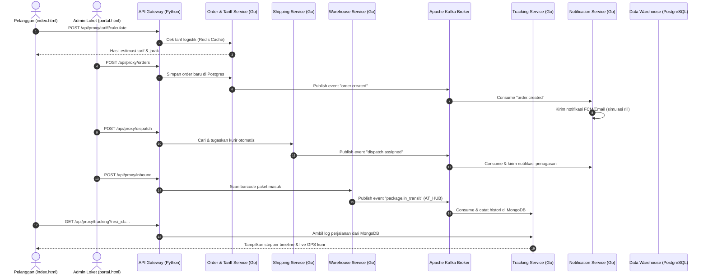

# PAPITON Express — Sistem Mikroservis Logistik Terintegrasi

PAPITON Express adalah platform pengiriman barang dan logistik terdistribusi yang dibangun dengan arsitektur mikroservis (*microservices*), pola *Database-per-Service* untuk isolasi data, dan *Event-Driven Architecture* menggunakan Apache Kafka untuk sinkronisasi asinkron antar layanan.

Sistem ini dirancang untuk skalabilitas tinggi dan dilengkapi dengan visualisasi linimasa logistik, peta pelacakan GPS kurir real-time (Leaflet.js & MongoDB), integrasi caching Redis, serta pipeline data analitis (ETL) yang memicu pelatihan ulang model Machine Learning (ML) secara otomatis.

---

## 🛠️ Arsitektur & Tumpukan Teknologi

Sistem ini dibagi menjadi 5 mikroservis independen yang ditulis menggunakan **Go (Golang)**:
1.  **Order & Tariff Service** (Port `8082`): Perhitungan tarif logistik, caching Redis, verifikasi jarak geografis, dan penerbitan resi (AWB).
2.  **Shipping & Dispatch Service** (Port `8081`): Alokasi kurir otomatis (*Auto-Dispatch*), pencatatan titik koordinat kurir real-time di MongoDB, dan penyerahan barang (*Pick-Up*).
3.  **Warehouse & Inventory Service** (Port `8080`): Pemindaian paket masuk (*Inbound*), penyortiran jalur otomatis (*Sorting*), dan pengelompokan manifest kontainer truk (*Outbound*).
4.  **Tracking & Log Event Service** (Port `8083`): Menyimpan sejarah pelacakan logistik di MongoDB dan menyajikan *Track & Trace API*.
5.  **Notification & Messaging Service** (Port `8084`): Pengiriman email dan push notification simulasi berdasarkan *event stream* dari Kafka.

Layanan pendukung tambahan:
*   **ETL Pipeline & API Gateway** (Port `8085`): Consumer Python yang melakukan ETL data transaksional ke **Data Warehouse (DWH)** PostgreSQL star-schema, bertindak sebagai Proxy API Gateway untuk dashboard, dan meng-host auto-retraining model prediksi ETA Machine Learning.
*   **Databases**: PostgreSQL (Order DB, Shipping DB, Warehouse DB, Notif DB, DWH DB) dan MongoDB (Tracking Logs DB & Courier GPS DB).
*   **Broker**: Apache Kafka & ZooKeeper untuk event streaming.
*   **Caching**: Redis untuk pricing cache.

---

## 📋 Prasyarat Sistem

Pastikan perangkat Anda sudah terpasang:
*   [Docker](https://www.docker.com/) dan [Docker Compose](https://docs.docker.com/compose/)
*   Web Browser (Google Chrome / Mozilla Firefox) untuk mengakses dashboard frontend

---

## 🚀 Cara Menjalankan Aplikasi & Akses Web Portal

1.  **Clone repositori** dan pastikan Anda berada di direktori utama proyek.
2.  **Jalankan seluruh layanan menggunakan Docker Compose**:
    ```bash
    docker compose up -d --build
    ```
3.  **Periksa status container** untuk memastikan semua database dan aplikasi berjalan sehat:
    ```bash
    docker compose ps
    ```
4.  **Jalankan Server HTTP Lokal untuk Frontend** (Wajib dilakukan karena browser memblokir JavaScript ES6 Module jika dibuka langsung lewat berkas file://):
    *   **Metode A: Menggunakan VS Code Live Server (Direkomendasikan)**:
        1. Buka folder proyek `papiton-express` di VS Code.
        2. Klik tombol **Go Live** di bilah status kanan bawah VS Code.
        3. Browser akan otomatis membuka alamat `http://127.0.0.1:5500/dashboard/`.
    *   **Metode B: Menggunakan npx (Node.js)**:
        Jalankan perintah berikut di terminal root proyek:
        ```bash
        npx http-server ./dashboard -p 5500 --cors
        ```
        Lalu buka `http://localhost:5500/` di browser Anda.

5.  **Tautan Akses Halaman Web**:
    *   **Halaman Publik Konsumen**: `http://localhost:5500/index.html` (Melacak paket, peta live GPS, cek ongkir)
    *   **Portal Operasional Internal Staf**: `http://localhost:5500/portal.html` (Analitik DWH, Inbound scan, auto-dispatch)

---

## 🧭 Alur Panduan Simulasi & Demonstrasi Akhir (Langkah demi Langkah)

Gunakan alur ini saat mempresentasikan proyek kepada dosen penguji untuk memperlihatkan integrasi penuh mikroservis:

### Langkah 1: Buat Order Baru (Customer Desk)
1.  Buka dashboard dan klik menu **Customer Desk** di sidebar.
2.  Isi nama Pengirim, nama Penerima, kota asal (misal: `Bandung`), kota tujuan (misal: `Jakarta`), berat paket (kg), dan jenis layanan (`REGULAR`/`EXPRESS`/`CARGO`).
3.  Klik **Estimasi Tarif**. Ini akan memicu Order Service menghitung tarif. *Sistem akan menggunakan Redis Cache untuk memuat data pricing logistik secara instan jika ada.*
4.  Klik **Buat Pesanan**. Resi unik (AWB) akan terbit (Contoh: `BDG2606180001`). Simpan resi ini untuk langkah berikutnya.

### Langkah 2: Daftarkan & Tugaskan Kurir (Driver Dispatch)
1.  Klik menu **Driver Dispatch** di sidebar.
2.  (Opsional) Jika belum ada kurir terdaftar, daftarkan kurir baru pada form *Registrasi Kurir Baru* dengan Zona Operasional wilayah penjemputan (misal: `Bandung`).
3.  Di form *Penugasan Kurir Otomatis (Auto-Dispatch)*, masukkan kode AWB/Resi yang diterbitkan pada Langkah 1, lalu masukkan zona wilayah penjemputan (misal: `Bandung`).
4.  Klik **Tugaskan Kurir**. Sistem akan secara otomatis mencari kurir terdekat berstatus `AVAILABLE` di wilayah tersebut, mengubah statusnya menjadi `ON_DUTY`, dan merekam transaksi di Postgres.

### Langkah 3: Simulasi Perjalanan Kurir (Live GPS di MongoDB)
Untuk mensimulasikan kurir bergerak di jalan, Anda bisa mengirimkan titik koordinat GPS kurir terkini menggunakan API Client (seperti Postman).
*   **HTTP Method**: `POST` atau `PUT`
*   **URL**: `http://localhost:8085/api/proxy/couriers/location`
*   **Headers**: `Content-Type: application/json`
*   **Body (JSON)**:
    ```json
    {
      "courier_id": "C-001",
      "latitude": -6.8619,
      "longitude": 107.5944
    }
    ```
*(Koordinat di atas akan tersimpan secara real-time di database MongoDB `courier_locations`).*

### Langkah 4: Konfirmasi Penjemputan Paket (Driver Dispatch)
1.  Masih di tab **Driver Dispatch**, pada panel respons penugasan kurir, klik tombol **Confirm Pick Up** (Konfirmasi Pengambilan).
2.  Status penugasan kurir akan berubah menjadi `PICKED_UP` di PostgreSQL, dan event akan diterbitkan ke Kafka.

### Langkah 5: Proses Inbound Paket di Gudang (Warehouse Scan)
1.  Klik menu **Warehouse Scan** di sidebar.
2.  Masukkan resi AWB paket, lalu pilih Gudang Transit (misal: `WH-UPI` atau `WH-BDG`).
3.  Klik **Proses Inbound**. Paket dipindai masuk ke dalam Hub pergudangan untuk disortir, dan log status `AT_HUB` akan dikirimkan ke Kafka.

### Langkah 6: Lacak Paket & Visualisasikan di Peta (Track & Trace)
1.  Klik menu **Track & Trace** di sidebar.
2.  Masukkan resi AWB Anda pada kotak pencarian, lalu klik **Lacak Paket**.
3.  Sistem akan menampilkan **Linimasa Perjalanan Paket** secara lengkap (mulai dari order dibuat, kurir ditugaskan, penjemputan, hingga masuk hub gudang) yang dibaca dari MongoDB.
4.  **Peta Real-Time (Leaflet Map)** akan muncul di bawah linimasa:
    *   Jika paket sedang dibawa kurir, marker peta secara dinamis mem-plot titik GPS kurir terkini (`C-001`) yang diambil langsung dari MongoDB.
    *   Jika paket berada di gudang transit, marker peta akan mem-plot koordinat gudang tersebut di peta secara otomatis.

### Langkah 7: Kirim Log Akhir (Delivered) & Auto-Retraining Model ML
1.  Di tab **Track & Trace** bagian bawah, terdapat alat simulasi scan manual.
2.  Pilih Kode Status `DELIVERED`, lalu klik **Kirim Log Scan Manual**.
3.  Ketika status `DELIVERED` dikirim ke Kafka, ETL service di Python akan menghitung durasi perjalanan riil paket (dari order dibuat hingga diterima) dan menyimpannya ke Data Warehouse.
4.  **Auto-Retraining ML**: Di console terminal container `etl-service`, Anda akan melihat teks pemberitahuan bahwa model Machine Learning prediksi ETA logistik otomatis melatih ulang dirinya (`train_model()`) menggunakan data fakta terbaru di DWH!

### Langkah 8: Pantau Grafik Analitik DWH (Dashboard DWH)
1.  Kembali ke menu **Dashboard DWH** di sidebar.
2.  Anda akan melihat grafik analitik pendapatan total, tren volume bulanan, rasio sukses notifikasi, serta rata-rata rating performa driver ter-update secara berkala (real-time sync dari Data Warehouse PostgreSQL).

---

## 🔌 Arsitektur Teknis & Alur Event-Driven (EDA)

Berikut adalah diagram alur koordinasi teknis antar-mikroservis asinkron menggunakan Apache Kafka dan PostgreSQL/MongoDB:

### 1. Diagram Alur Transaksi & Sinkronisasi


### 2. Logika Pemrosesan Teknis Detil
Setiap langkah dalam sistem ini terikat pada fungsionalitas handal berikut:
*   **Idempotensi (Anti-Duplikasi)**: Ketika `Notification Service` membaca event dari Kafka, ia akan mencocokkan `event_id` ke tabel database `processed_events`. Jika `event_id` sudah pernah diproses, event dibuang secara diam-diam (*silently discarded*) untuk menjaga integritas data.
*   **Retry Strategy dengan Exponential Backoff**: Jika pengiriman notifikasi gagal (misal dipicu dengan kata kunci `"FAIL-TEST"`), sistem akan mencoba kembali sebanyak maksimal **5 kali** dengan penundaan waktu yang membesar secara eksponensial (`1s`, `2s`, `4s`, `8s`, `16s`).
*   **Dead Letter Queue (DLQ)**: Jika setelah 5 kali retry pengiriman tetap gagal, pesan akan dilempar ke topik Kafka `papiton.dlq.events` bersama detail alasan error.
*   **Auto-Retraining Machine Learning**: Ketika status pelacakan paket berubah menjadi `DELIVERED`, ETL Pipeline Python menangkap perubahan tersebut, menyimpannya ke Data Warehouse, dan memicu thread background untuk melatih ulang model regresi linear (`LinearRegression`) scikit-learn secara real-time guna memperbarui perkiraan durasi ETA order berikutnya.

---

## 🧹 Cara Menghentikan Aplikasi

Jika simulasi telah selesai dan Anda ingin mematikan container docker:
```bash
docker compose down -v
```
*(Parameter `-v` akan menghapus seluruh data volume database agar bersih saat pengujian berikutnya).*
