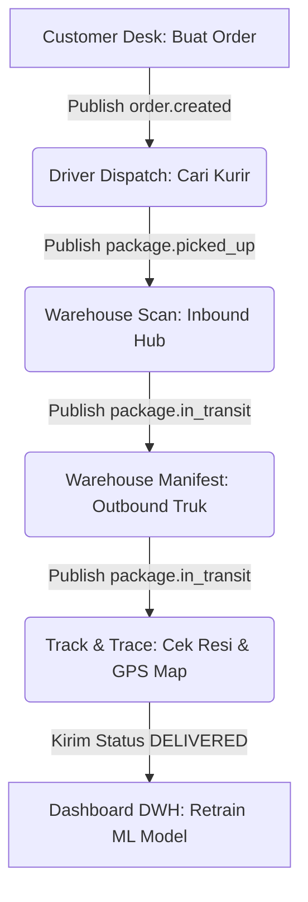

# 📖 Panduan Live Demo Frontend — PAPITON Express
Dokumen ini berisi panduan langkah demi langkah (*scripted walkthrough*) untuk melakukan demonstrasi (*live demo*) aplikasi PAPITON Express melalui antarmuka frontend (Dashboard & Staff Portal) saat presentasi di depan dosen/penguji.

---

## 🗺️ 1. Persiapan Awal (Setup)
Sebelum memulai demo, pastikan seluruh infrastruktur berjalan lancar di backend dengan membuka terminal dan menjalankan perintah pengecekan:
```powershell
# Memastikan 18 container statusnya "Up"
docker compose ps
```

Buka halaman antarmuka berikut pada browser Anda (Google Chrome direkomendasikan):
1.  **Staff Portal (Operasional)**: [portal.html](file:///D:/Kuliah/semester%204/cloud/tubes/microservice-papiton-express/papiton-express/dashboard/portal.html) *(Tempat utama menjalankan simulasi alur paket)*.
2.  **Dashboard Utama (OLAP & ML)**: [index.html](file:///D:/Kuliah/semester%204/cloud/tubes/microservice-papiton-express/papiton-express/dashboard/index.html) *(Tab terpisah untuk memantau metrik agregat)*.

---

## 🔄 2. Skenario Live Demo: Perjalanan Paket End-to-End

Ikuti langkah-langkah di bawah ini secara berurutan sesuai alur logistik riil:



### 📦 TAHAP 1: Customer Desk (Order & Tariff Service)
*   **Tujuan**: Menunjukkan proses pemesanan paket baru dan kalkulasi tarif berdasarkan jarak.
*   **Langkah Demo**:
    1.  Buka tab **Customer Desk** di sidebar kiri.
    2.  Isi data Profil Pengirim (misal: Kota Asal **Bandung**, alamat `Jl. Ganesha No.10`).
    3.  Isi data Profil Penerima (misal: Kota Tujuan **Jakarta**, alamat `Jl. Jenderal Sudirman Kav. 21`).
    4.  Masukkan berat paket (misal: **3.5** kg).
    5.  Klik tombol **Hitung Estimasi Tarif** ➔ Tunjukkan ke penguji tarif dasar dan biaya jarak dihitung otomatis oleh server.
    6.  Klik tombol **Submit Order** ➔ Pesanan disimpan ke database PostgreSQL `order_db` dan kode resi (**AWB**) unik digenerate.
    7.  *Tunjukkan*: Di sidebar bagian *Variabel Aktif*, nilai **AWB** kini otomatis berubah dari `RESI-EMPTY` menjadi kode resi baru (misal: `BDG260618xxxxxx`).

---

### 🚚 TAHAP 2: Driver Dispatch (Shipping & Dispatch Service)
*   **Tujuan**: Menunjukkan pencarian kurir terdekat secara otomatis (*Auto-Dispatch*) berdasarkan lokasi asal pengiriman.
*   **Langkah Demo**:
    1.  Buka tab **Driver Dispatch**.
    2.  *Tunjukkan*: Kolom **Kode AWB** sudah **otomatis terisi** oleh resi yang baru Anda buat pada tahap sebelumnya.
    3.  Klik tombol **Auto-Dispatch**.
    4.  *Penjelasan*: Sistem mencari kurir terdekat di zona Bandung yang berstatus `AVAILABLE`, menugaskannya, mengalokasikan bagi hasil (70% untuk kurir), dan mengubah statusnya menjadi `ON_DUTY`.
    5.  *Tunjukkan*: Sidebar kiri kolom **Dispatch** kini terisi dengan ID penugasan (misal: `DSP-xxxxxx`).

---

### 🏢 TAHAP 3: Warehouse Transit & Manifest (Warehouse Service)
*   **Tujuan**: Menunjukkan pencatatan barang masuk (*inbound*) di hub transit dan pengelompokan paket ke armada truk (*outbound manifest*).
*   **Langkah Demo**:
    1.  Buka tab **Warehouse Scan**.
    2.  **Proses Inbound**:
        *   Kolom barcode AWB sudah terisi otomatis. Pilih **Gudang Transit Sekarang** (misal: `Hub Utama Bandung (WH-BDG)`).
        *   Klik **Proses Scan Inbound** ➔ Paket terdaftar masuk ke gudang transit Bandung.
    3.  **Buat Manifest Truk (Outbound)**:
        *   Geser ke bawah ke bagian *Pembuatan & Pengiriman Manifest Truk*.
        *   Isi Plat Nomor Truk (misal: `D-9988-ABC`) dan Nama Supir.
        *   Klik **Buat Manifest Truk** ➔ ID Manifest baru (misal: `MNF-xxxxxx`) terbuat dan tersimpan di sidebar kiri.
    4.  **Masukkan Paket ke Truk**:
        *   Di bagian *2. Masukkan Paket ke Manifest*, ID Manifest dan AWB paket kamu sudah otomatis terisi.
        *   Klik **Masukkan ke Manifest** ➔ Paket diasosiasikan ke truk cargo tersebut.
    5.  **Berangkatkan Truk**:
        *   Di bagian *3. Update Perjalanan Manifest*, klik **Update Perjalanan Truk** dengan aksi `DEPART` ➔ Truk statusnya menjadi jalan dan event terkirim ke Kafka.

---

### 🔍 TAHAP 4: Track & Trace (Tracking Service — MongoDB)
*   **Tujuan**: Menunjukkan pelacakan riwayat perjalanan paket secara kronologis terstruktur dari database NoSQL MongoDB.
*   **Langkah Demo**:
    1.  Buka tab **Track & Trace**.
    2.  Nomor AWB kamu sudah terisi otomatis. Klik **Lacak Paket**.
    3.  Tunjukkan riwayat linimasa perjalanan paket yang tersusun rapi:
        *   `CREATED` (Order dibuat di Bandung)
        *   `ASSIGNED` (Kurir ditugaskan)
        *   `IN_TRANSIT` (Barang masuk ke gudang `WH-BDG`)
    4.  Tunjukkan posisi marker kurir/lokasi paket terakhir pada peta Leaflet.
    5.  **Simulasi Selesai Kirim**:
        *   Di bagian bawah (*Simulasi Scan Barcode Manual*), pilih status **`DELIVERED`** (Paket diterima customer), lalu klik **Kirim Log Scan Manual**.
        *   Klik kembali tombol **Lacak Paket** di atas ➔ Linimasa ter-update instan menampilkan status `DELIVERED`.

---

### 📊 TAHAP 5: Dashboard DWH & Machine Learning (ETL & OLAP)
*   **Tujuan**: Menunjukkan visualisasi analitik data warehouse (Star Schema) dan pembelajaran ulang model prediksi ETA secara dinamis.
*   **Langkah Demo**:
    1.  Buka tab **Dashboard DWH** di portal atau buka file [index.html](file:///D:/Kuliah/semester%204/cloud/tubes/microservice-papiton-express/papiton-express/dashboard/index.html).
    2.  Tunjukkan grafik metrik omset total, proporsi jenis layanan, dan kepadatan inbound gudang yang langsung bertambah setelah alur demo diselesaikan.
    3.  *Penjelasan ML*: Jelaskan bahwa saat status paket berubah menjadi `DELIVERED`, durasi nyata pengiriman dihitung. ETL Service (`etl-service`) secara otomatis memicu fungsi **pembelajaran ulang (dynamic retraining)** model Regresi Linear (`eta_model.pkl`) menggunakan library Scikit-Learn di latar belakang untuk mengoptimalkan prediksi ETA berikutnya.

---

## 🌟 3. "Wow Factor" untuk Dipresentasikan Ke Dosen

Gunakan poin-poin ini sebagai senjata utama untuk mendapatkan nilai maksimal:

1.  **Event-Driven Architecture (EDA)**: Tunjukkan terminal logs asinkron Kafka saat tombol submit diklik:
    ```powershell
    # Jalankan perintah ini di depan dosen sebelum memicu tombol di browser
    docker compose logs -f notification-app tracking-app
    ```
    *Dosen akan melihat event terkirim dan terproses seketika secara asinkron tanpa memblokir aplikasi utama.*
2.  **Live GPS Tracker**: Di tab *Track & Trace*, jelaskan bahwa ketika kurir berstatus membawa barang (`PICKED_UP` atau `OUT_FOR_DELIVERY`), peta Leaflet tidak lagi hardcode, melainkan melakukan polling koordinat GPS live driver langsung dari database MongoDB `shipping-mongo`.
3.  **Gateway Security & Reliability**: Jelaskan bahwa seluruh request frontend tidak menembak port microservice (`8080`-`8084`) secara langsung, melainkan lewat API Gateway Proxy port `8085` yang otomatis menyuntikkan token keamanan `X-API-Key` dan `X-Correlation-ID` untuk tracing log terdistribusi.
