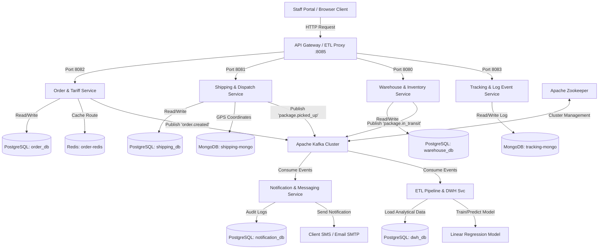

# ⚙️ Panduan Infrastruktur & Sistem Integrasi PAPITON Express

Dokumen ini menjelaskan secara mendalam tentang arsitektur jaringan, penggunaan event broker (Kafka & Zookeeper), serta strategi pemilihan basis data (*polyglot persistence*) yang diterapkan dalam sistem mikroservis **PAPITON Express**.

---

## 🗺️ Diagram Arsitektur Integrasi

Berikut adalah gambaran bagaimana setiap komponen saling berinteraksi secara asinkron melalui Apache Kafka dan menggunakan penyimpanan database masing-masing secara terisolasi (*Database-per-Service*):

---

## 🎡 1. Apache Kafka & Zookeeper: Jantung Komunikasi Asinkron

Dalam arsitektur mikroservis, komunikasi antar-layanan terbagi menjadi dua jenis: **Sinkron (Synchronous REST API)** dan **Asinkron (Asynchronous Event-Driven)**. 

Sistem PAPITON Express menggunakan **Apache Kafka** untuk menangani komunikasi asinkron guna menghindari ketergantungan langsung antar-layanan (*decoupling*).

### A. Apache Kafka (Event/Message Broker)
Kafka bertindak sebagai papan pengumuman log pusat yang mencatat setiap peristiwa penting (*event*) dalam sistem logistik.
*   **Decoupling (Pemisahan Tugas)**: Ketika order dibuat, `order-app` cukup mempublikasikan event `order.created` ke Kafka. Layanan ini tidak perlu tahu siapa saja yang membutuhkan informasi tersebut.
*   **Asynchronous Processing**: Layanan yang lambat (seperti `notification-app` yang harus menghubungi SMTP Server eksternal) dapat memproses data secara mandiri tanpa membuat pengguna menunggu lama di antarmuka pembuatan order.
*   **Penerapan di PAPITON Express**:
    *   **Topik `papiton.events.order`**: Menerima data pembuatan order baru. Didengar oleh `notification-app` (kirim email konfirmasi) dan `etl-service` (pencatatan data warehousing).
    *   **Topik `papiton.events.shipping`**: Menerima event penugasan kurir (`dispatch.assigned`).
    *   **Topik `papiton.events.tracking`**: Menerima log pemindaian gudang (`package.in_transit`). Didengar oleh `tracking-app` untuk menyatukan histori perjalanan paket di MongoDB.

### B. Apache Zookeeper (Cluster Coordinator)
Zookeeper adalah asisten manajer yang bertugas mengelola kesehatan kluster Kafka.
*   Dalam lingkungan produksi, Kafka dijalankan di banyak server (kluster) untuk menghindari kehilangan data (*High Availability*). Di docker-compose, kita mensimulasikan ini dengan 3 broker: `kafka`, `kafka2`, dan `kafka3`.
*   **Peran Zookeeper**:
    1.  Mendeteksi jika salah satu broker Kafka mengalami kerusakan atau mati.
    2.  Menentukan broker mana yang memimpin (*leader election*) untuk menulis atau mereplikasi data di setiap topik logistik.
    3.  Menyimpan metadata konfigurasi topik.

---

## 💾 2. Strategi Polyglot Persistence (Pemilihan Database)

Kami menerapkan strategi **Polyglot Persistence**, yaitu memilih jenis database terbaik yang disesuaikan dengan kebutuhan spesifik masing-masing servis.

### A. PostgreSQL: Database Relasional Transaksional (SQL)
Digunakan untuk data yang membutuhkan konsistensi sangat tinggi dan mematuhi aturan transaksi **ACID** (Atomicity, Consistency, Isolation, Durability).
*   **Tempat Penerapan**: `order-db`, `warehouse-db`, `shipping-db`, `notification-db`, dan `dwh-db`.
*   **Mengapa SQL?** Data seperti pesanan, tarif, daftar gudang (*hub*), dan manifest keberangkatan truk adalah data bisnis penting yang strukturnya kaku. Jika terjadi kegagalan (misalnya koneksi internet putus saat memasukkan paket ke manifest), database PostgreSQL akan melakukan *rollback* otomatis sehingga tidak ada data menggantung atau tidak konsisten.

### B. MongoDB: Database Berorientasi Dokumen (NoSQL)
Digunakan untuk data dengan throughput penulisan tinggi (*high-write throughput*) yang tidak memerlukan relasi tabel yang rumit.
*   **Tempat Penerapan**: 
    1.  `tracking-mongo` (servis pelacakan resi): Menyimpan riwayat perjalanan paket yang tipenya dinamis (bisa bertambah detail lokasinya sewaktu-waktu).
    2.  `shipping-mongo` (servis kurir): Menyimpan log koordinat GPS kurir yang terus berubah setiap detik.
*   **Mengapa MongoDB?** MongoDB menyimpan data dalam format BSON (JSON biner) yang fleksibel tanpa skema ketat (*schema-less*). Hal ini membuat proses penulisan log perjalanan kurir dan pelacakan resi menjadi sangat cepat dan efisien tanpa membebani database transaksional utama.

### C. Redis: Database di Dalam Memori (In-Memory Key-Value Cache)
Digunakan untuk menyimpan data sementara dengan kecepatan baca di bawah 1 milidetik.
*   **Tempat Penerapan**: `order-redis` (pada servis pemesanan & tarif).
*   **Mengapa Redis?** Perhitungan jarak koordinat kota (PostGIS) membutuhkan daya komputasi CPU yang cukup intens. Redis bertindak sebagai *cache memory*. Hasil perhitungan rute kota Bandung-Jakarta disimpan di Redis (TTL 24 Jam). Jika ada pesanan berikutnya untuk rute yang sama, sistem langsung membaca dari Redis secara instan tanpa perlu memproses ulang di database Postgres.

---

## 🌟 Ringkasan Keuntungan Arsitektur Ini

1.  **Fault Tolerance**: Jika database tracking (`tracking-mongo`) down, pengguna tetap bisa membuat order baru di frontend karena `order-app` and `order-db` berjalan di server dan database terpisah yang terisolasi.
2.  **Scalability**: Kita bisa memperbanyak (*scale out*) container `notification-app` menjadi 5 instance untuk mengonsumsi antrean Kafka secara paralel jika volume email yang dikirim melonjak tinggi di hari libur.
3.  **Performance Optimization**: Pemrosesan berat seperti machine learning (ETL) dan pengiriman email didelegasikan secara asinkron di belakang layar melalui Kafka, membuat respon API di frontend tetap responsif di bawah 200 milidetik.
