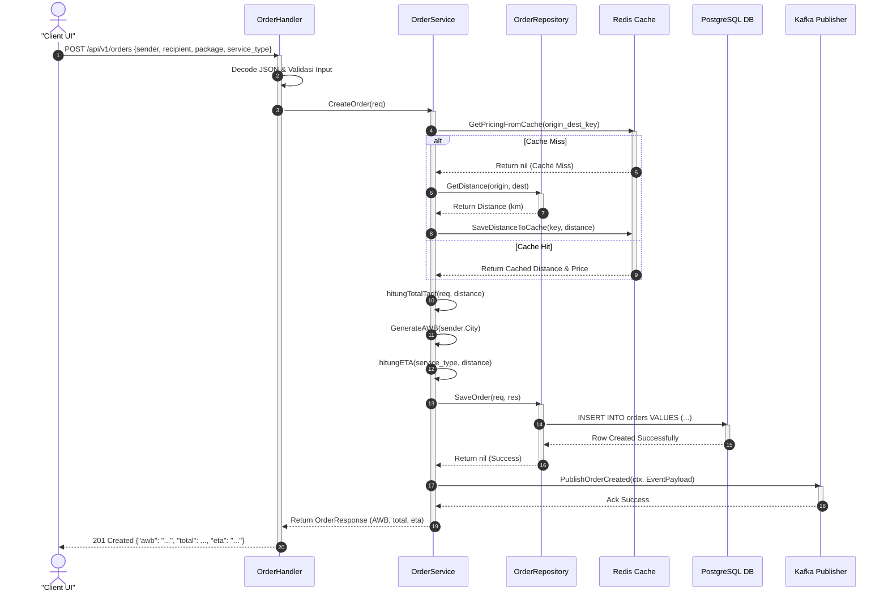
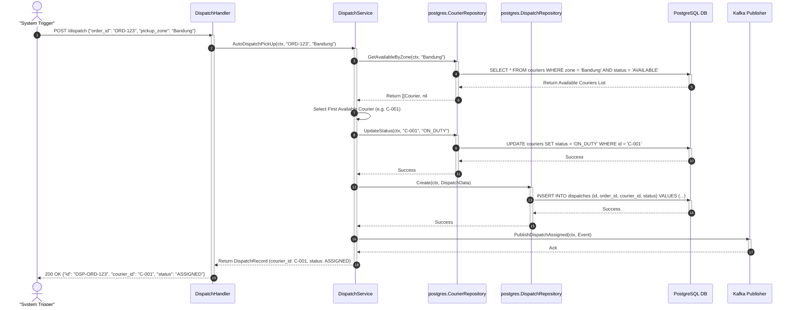
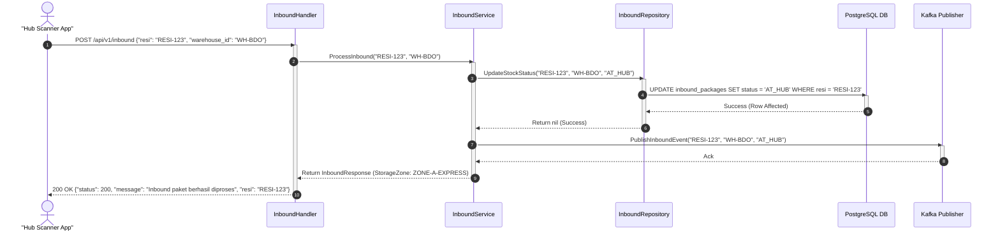
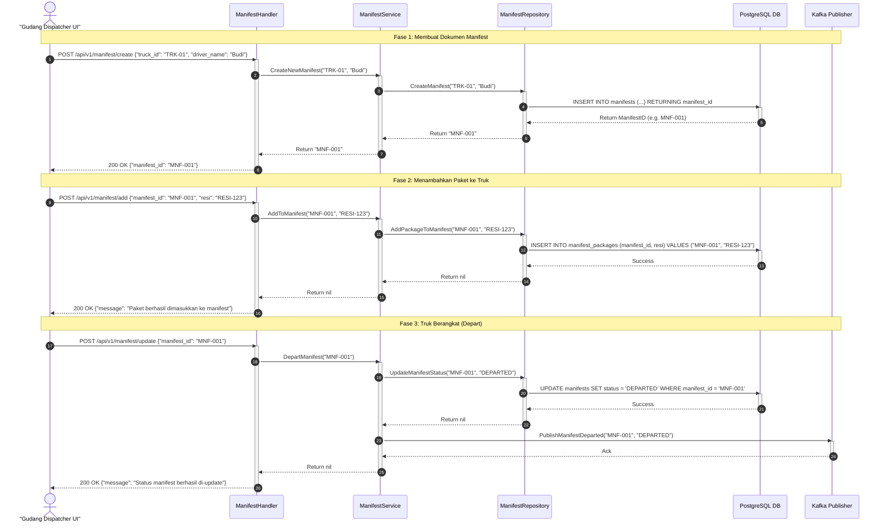

# SOFTWARE DESIGN DOCUMENT (SDD)
## PAPITON EXPRESS — SISTEM MIKROSERVIS LOGISTIK

Dokumen ini menjelaskan rancangan perangkat lunak untuk sistem **PAPITON Express**, sebuah platform logistik terintegrasi berbasis arsitektur mikroservis (*microservices architecture*).

---

## 1. INFORMASI DOKUMEN & KONTROL VERSI

| Atribut | Detail |
|---|---|
| **Nama Proyek** | PAPITON Express |
| **Dokumen** | Software Design Document (SDD) |
| **Versi** | 1.0.0 |
| **Tanggal Pembuatan** | 11 Juni 2026 |
| **Instansi/Mata Kuliah** | Tugas Besar - Pengembangan Sistem Cloud / Komputasi Awan |
| **Pembuat / Tim** | Kelompok 5 — PAPITON Express |
| **Status Dokumen** | Rilis Resmi |

### Riwayat Revisi
| Versi | Tanggal | Penulis | Deskripsi Perubahan |
|---|---|---|---|
| 1.0.0 | 11 Juni 2026 | Kelompok 5 | Inisialisasi dokumen SDD lengkap mencakup 5 layanan mikro, skema database relasional & NoSQL, integrasi Kafka, alur sequence, dan skema deployment. |

---

## 2. PENDAHULUAN

### 2.1 Deskripsi Sistem
**PAPITON Express** adalah platform pengiriman barang dan logistik berbasis mikroservis yang dirancang untuk menangani beban tinggi (*high scalability*) dan keandalan sistem (*reliability*). Sistem ini membagi operasional bisnis logistik menjadi beberapa domain spesifik: pemesanan dan perhitungan tarif, penugasan kurir secara otomatis, penerimaan serta penyusunan manifest paket di gudang/hub, pelacakan riwayat paket real-time, dan pengiriman notifikasi instan kepada pengguna.

### 2.2 Tujuan Dokumen
Dokumen Desain Perangkat Lunak (*Software Design Document*) ini bertujuan untuk:
1. Menyediakan panduan teknis yang detail mengenai arsitektur sistem kepada tim pengembang (*developers*) dan analis sistem.
2. Mendefinisikan kontrak interface (API REST) dan skema pesan event-driven (Kafka) untuk integrasi antar layanan.
3. Menjelaskan struktur database relasional (PostgreSQL), penyimpanan dokumen (MongoDB), dan mekanisme caching (Redis) yang digunakan oleh masing-masing layanan mikro.
4. Mendokumentasikan konfigurasi infrastruktur berbasis Docker Compose, Kubernetes, dan pipeline CI/CD Jenkins.

### 2.3 Lingkup Sistem
Sistem PAPITON Express mencakup 5 modul mikroservis utama:
1. **[Order & Tariff Service](file:///D:/Kuliah/semester%204/cloud/tubes/microservice-papiton-express/papiton-express/order-tariff-service)**: Mengelola pemesanan baru, verifikasi koordinat, pencarian jarak, perhitungan tarif pengiriman logistik, dan pembuatan nomor resi (*Airway Bill* / AWB).
2. **[Shipping & Dispatch Service](file:///D:/Kuliah/semester%204/cloud/tubes/microservice-papiton-express/papiton-express/shipping-service)**: Mengatur alokasi kurir penjemputan secara otomatis (*Auto-Dispatch*), konfirmasi penyerahan barang (*Pick-Up*), dan pelacakan GPS lokasi kurir.
3. **[Warehouse & Inventory Service](file:///D:/Kuliah/semester%204/cloud/tubes/microservice-papiton-express/papiton-express/warehouse-and-inventory-service)**: Mengelola penerimaan paket masuk ke gudang (*Inbound*), penyortiran jalur otomatis (*Sorting*), pengelompokan paket ke dalam truk (*Manifest*), dan keberangkatan truk logistik (*Outbound*).
4. **[Tracking & Log Event Service](file:///D:/Kuliah/semester%204/cloud/tubes/microservice-papiton-express/papiton-express/tracking-and-logevent-service)**: Menangkap semua pemindaian logistik di titik transit dan melayani query pencarian riwayat paket (*AWB tracking*) bagi pengguna akhir.
5. **[Notification & Messaging Service](file:///D:/Kuliah/semester%204/cloud/tubes/microservice-papiton-express/papiton-express/notification-and-messaging-service)**: Mengirimkan email konfirmasi dan push notification ke perangkat ponsel pengguna secara asinkron berdasarkan event-event logistik yang terjadi.

### 2.4 Glosarium & Definisi
*   **AWB (Airway Bill)**: Nomor resi unik pengiriman paket (contoh format: `BDG240430120000X1Y2`).
*   **Inbound**: Proses masuk dan pemindaian paket ketika sampai di dalam gudang (*Hub*).
*   **Outbound / Manifest**: Dokumen daftar paket yang dimuat ke dalam suatu truk pengiriman untuk dikirim ke hub tujuan.
*   **Auto-Dispatch**: Algoritma otomatis untuk mencocokkan order pick-up dengan kurir terdekat yang tersedia.
*   **Event-Driven**: Arsitektur di mana layanan berinteraksi dengan cara mengirimkan pesan kejadian (*event*) ke broker terpusat daripada melakukan panggilan langsung (HTTP synchronous).
*   **Idempotency**: Properti di mana operasi dapat dijalankan beberapa kali tanpa memberikan efek samping atau hasil yang berbeda dari eksekusi pertama.

---

## 3. ARSITEKTUR SISTEM & DESAIN TEKNOLOGI

### 3.1 Diagram Arsitektur Tingkat Tinggi
Sistem logistik PAPITON Express menggunakan pola **Database-per-Service** untuk memastikan isolasi data dan otonomi layanan yang penuh, dipadukan dengan **Event-Driven Architecture** menggunakan Kafka untuk sinkronisasi asinkron.

```mermaid
graph TD
    Client[Client UI / Mobile & Web] -->|HTTP POST /api/v1/orders| OrderSvc[Order & Tariff Service]
    Client -->|HTTP POST /dispatch| ShippingSvc[Shipping & Dispatch Service]
    Client -->|HTTP POST /api/v1/inbound| WarehouseSvc[Warehouse & Inventory Service]
    Client -->|HTTP GET /api/v1/tracking| TrackingSvc[Tracking & Log Event Service]

    subgraph Database Layer
        OrderDB[(Order DB: PostgreSQL)] --- OrderSvc
        OrderCache[(Order Cache: Redis)] --- OrderSvc
        ShippingDB[(Courier DB: PostgreSQL)] --- ShippingSvc
        CourierGPS[(Location DB: MongoDB)] --- ShippingSvc
        WarehouseDB[(Warehouse DB: PostgreSQL)] --- WarehouseSvc
        TrackingDB[(Tracking DB: MongoDB)] --- TrackingSvc
        NotifDB[(Notif Log DB: PostgreSQL/InMemory)] --- NotifSvc[Notification & Messaging Service]
    end

    subgraph Message Broker (Kafka)
        OrderTopic((papiton.events.order))
        ShippingTopic((papiton.events.shipping))
        TrackingTopic((papiton.events.tracking))
    end

    OrderSvc -->|Publish OrderCreated| OrderTopic
    ShippingSvc -->|Publish CourierAssigned / PickedUp| ShippingTopic
    WarehouseSvc -->|Publish PackageInbound / ManifestDeparted| TrackingTopic

    OrderTopic -.->|Subscribe| TrackingSvc
    ShippingTopic -.->|Subscribe| TrackingSvc
    TrackingTopic -.->|Subscribe| TrackingSvc

    OrderTopic -.->|Subscribe| NotifSvc
    ShippingTopic -.->|Subscribe| NotifSvc
    TrackingTopic -.->|Subscribe| NotifSvc

    NotifSvc -->|Kirim Email| EmailServer[SMTP Server]
    NotifSvc -->|Kirim Push Notification| FCM[Firebase Cloud Messaging]
```

### 3.2 Tumpukan Teknologi (Tech Stack)
*   **Programming Language**: Go (Golang) 1.20+ untuk semua layanan mikro (mengutamakan kecepatan eksekusi dan efisiensi memori).
*   **Web Framework / Library**: Standard library `net/http` untuk handler HTTP (tanpa framework berat tambahan untuk meminimalisasi *dependency issues*).
*   **Databases**:
    *   **PostgreSQL 15**: Digunakan untuk data transaksional relasional (Order, Courier Profile, Warehouse Manifest, Notification Logs).
    *   **MongoDB 6**: Digunakan untuk penyimpanan data berfrekuensi tulis tinggi (*high throughput write-heavy*) seperti logs tracking koordinat GPS kurir dan riwayat tracking transit resi.
    *   **Redis**: Digunakan untuk caching perhitungan tarif dan jarak kota untuk mengoptimalkan latensi respon API pembuatan order.
*   **Event Broker**: **Apache Kafka 7.3 (Confluent CP)** yang dikelola oleh **ZooKeeper** untuk menjamin pengantaran pesan asinkron (*asynchronous message delivery*).
*   **Containerization & Deployment**: Docker, Docker Compose (untuk pengembangan lokal), Kubernetes (untuk skala produksi), dan Jenkins (CI/CD Pipeline).

### 3.3 Penjelasan Desain Clean Architecture
Setiap layanan ditulis mengikuti prinsip **Clean Architecture** dengan pemisahan folder yang jelas untuk menjaga modularitas kode dan kemudahan unit testing:
*   `cmd/`: Berisi berkas entrypoint utama (`main.go`) tempat inisialisasi koneksi database, dependency injection, routing HTTP, dan penyalaan server.
*   `internal/domain/`: Menyimpan definisi entitas domain bisnis, skema payload model, serta kontrak interface (repository & service) yang abstrak.
*   `internal/handler/`: Controller yang menangani komunikasi HTTP (membaca request payload, validasi data, memanggil service layer, dan memformat JSON response).
*   `internal/service/`: Layer inti bisnis logika (*core business logic*), tempat seluruh kalkulasi dan alur workflow dijalankan. Layer ini tidak mengetahui detail implementasi database.
*   `internal/repository/`: Layer implementasi akses data konkret ke database (PostgreSQL, MongoDB, Redis, atau Kafka Publisher).
*   `mocks/`: Auto-generated mock files menggunakan `gomock` untuk mendukung isolasi testing pada layer bisnis logika.

---

## 4. ARSITEKTUR DATA & DESAIN DATABASE

### 4.1 Hubungan Antar Layanan (Data Context)
Setiap mikroservis memiliki database sendiri. Referensi silang antar entitas dilakukan dengan menggunakan ID Kunci (seperti `awb` atau `courier_id`).

### 4.2 Skema Tabel Relasional (PostgreSQL)

#### 4.2.1 Order & Tariff Service — Database: `papiton_order_tariff_service_db`
Layanan ini mengelola data pesanan pelanggan di dalam tabel `orders`:

```sql
CREATE TABLE orders (
    awb VARCHAR(50) PRIMARY KEY,                    -- Nomor resi unik (AWB)
    sender_name VARCHAR(100) NOT NULL,              -- Nama pengirim
    sender_phone VARCHAR(50) NOT NULL,              -- Telepon pengirim
    sender_email VARCHAR(100) NOT NULL,             -- Email pengirim
    sender_address TEXT NOT NULL,                   -- Alamat lengkap pengirim
    sender_city VARCHAR(50) NOT NULL,               -- Kota pengirim
    sender_lat DOUBLE PRECISION NOT NULL,           -- Lintang koordinat pengirim
    sender_lng DOUBLE PRECISION NOT NULL,           -- Bujur koordinat pengirim
    
    recipient_name VARCHAR(100) NOT NULL,           -- Nama penerima
    recipient_phone VARCHAR(50) NOT NULL,           -- Telepon penerima
    recipient_email VARCHAR(100) NOT NULL,          -- Email penerima
    recipient_address TEXT NOT NULL,                -- Alamat lengkap penerima
    recipient_city VARCHAR(50) NOT NULL,            -- Kota penerima
    recipient_lat DOUBLE PRECISION NOT NULL,        -- Lintang koordinat penerima
    recipient_lng DOUBLE PRECISION NOT NULL,        -- Bujur koordinat penerima
    
    package_length DOUBLE PRECISION NOT NULL,       -- Panjang paket (cm)
    package_width DOUBLE PRECISION NOT NULL,        -- Lebar paket (cm)
    package_height DOUBLE PRECISION NOT NULL,       -- Tinggi paket (cm)
    package_weight DOUBLE PRECISION NOT NULL,       -- Berat aktual paket (kg)
    volumetric_weight DOUBLE PRECISION NOT NULL DEFAULT 0.0, -- Berat volumetrik paket (kg)
    
    service_type VARCHAR(20) NOT NULL,              -- Jenis layanan (REGULAR, EXPRESS, CARGO)
    has_insurance BOOLEAN NOT NULL DEFAULT FALSE,   -- Status asuransi
    has_packing BOOLEAN NOT NULL DEFAULT FALSE,     -- Status packing kayu
    
    tarif_total DOUBLE PRECISION NOT NULL,          -- Total biaya yang harus dibayar
    distance DOUBLE PRECISION NOT NULL,             -- Jarak pengiriman (km)
    eta VARCHAR(50) NOT NULL,                       -- Perkiraan waktu sampai (ETA)
    status VARCHAR(50) NOT NULL,                    -- Status order (CREATED, ASSIGNED, dll.)
    created_at TIMESTAMP DEFAULT CURRENT_TIMESTAMP  -- Waktu pembuatan order
);
```

#### 4.2.2 Shipping & Dispatch Service — Database: `shipping_test_db`
Layanan ini menggunakan dua tabel di PostgreSQL untuk mengelola armada dan penugasan kurir:

```sql
-- Tabel profil kurir armada
CREATE TABLE couriers (
    id VARCHAR(50) PRIMARY KEY,                     -- ID Kurir unik
    name VARCHAR(100) NOT NULL,                     -- Nama kurir
    phone_number VARCHAR(50) NOT NULL,              -- Nomor telepon aktif
    zone VARCHAR(50) NOT NULL,                      -- Zona operasional wilayah
    status VARCHAR(20) NOT NULL,                    -- Status (AVAILABLE, ON_DUTY, OFFLINE)
    vehicle_type VARCHAR(50) NOT NULL               -- Jenis kendaraan (MOTORCYCLE, VAN)
);

-- Tabel transaksi penugasan kurir
CREATE TABLE dispatches (
    id VARCHAR(50) PRIMARY KEY,                     -- ID penugasan (dispatch_id)
    order_id VARCHAR(50) NOT NULL,                  -- ID order (awb)
    courier_id VARCHAR(50) NOT NULL,                -- ID kurir yang bertugas
    status VARCHAR(20) NOT NULL,                    -- Status (ASSIGNED, PICKED_UP, DELIVERED, FAILED)
    route_instruction TEXT NOT NULL                 -- Instruksi peta rute perjalanan
);
```

#### 4.2.3 Warehouse & Inventory Service — Database: `papiton_warehouse`
Layanan pergudangan merekam master gudang, alur inbound paket, dan pembuatan manifest kontainer truk logistik:

```sql
-- Tabel master data gudang/hub
CREATE TABLE warehouses (
    warehouse_id VARCHAR(50) PRIMARY KEY,           -- ID Gudang (contoh: WH-BDG, WH-UPI)
    name VARCHAR(100) NOT NULL,                     -- Nama gudang
    city VARCHAR(50) NOT NULL,                      -- Kota gudang berada
    region VARCHAR(50) NOT NULL,                    -- Wilayah provinsi gudang
    warehouse_type VARCHAR(20) NOT NULL             -- Jenis gudang (HUB, REGIONAL, TRANSIT)
);

-- Tabel pencatatan paket masuk di Hub pergudangan
CREATE TABLE inbound_packages (
    resi VARCHAR(50) PRIMARY KEY,                   -- Nomor resi paket
    warehouse_id VARCHAR(50) NOT NULL REFERENCES warehouses(warehouse_id), -- Referensi gudang
    status VARCHAR(50) NOT NULL,                    -- Status logistik (AT_HUB, SORTING, dll.)
    is_express BOOLEAN DEFAULT FALSE,               -- Apakah paket bertipe ekspres
    special_handling TEXT,                          -- Instruksi khusus penanganan
    created_at TIMESTAMP DEFAULT CURRENT_TIMESTAMP,
    updated_at TIMESTAMP DEFAULT CURRENT_TIMESTAMP
);

-- Tabel manifest kontainer keberangkatan truk logistik
CREATE TABLE manifests (
    manifest_id VARCHAR(50) PRIMARY KEY,            -- ID Manifest unik
    truck_id VARCHAR(50) NOT NULL,                  -- ID Plat truk logistik
    driver_name VARCHAR(100) NOT NULL,              -- Nama pengemudi truk
    status VARCHAR(50) NOT NULL DEFAULT 'CREATED',  -- Status manifest (CREATED, DEPARTED, ARRIVED)
    origin_warehouse VARCHAR(50) REFERENCES warehouses(warehouse_id),      -- Gudang asal
    destination_warehouse VARCHAR(50) REFERENCES warehouses(warehouse_id), -- Gudang tujuan
    created_at TIMESTAMP DEFAULT CURRENT_TIMESTAMP,
    updated_at TIMESTAMP DEFAULT CURRENT_TIMESTAMP
);

-- Tabel relasi persilangan Manifest dan Resi Paket (Many-to-Many)
CREATE TABLE manifest_packages (
    manifest_id VARCHAR(50) REFERENCES manifests(manifest_id) ON DELETE CASCADE,
    resi VARCHAR(50) REFERENCES inbound_packages(resi) ON DELETE CASCADE,
    PRIMARY KEY (manifest_id, resi)
);

-- Tabel penentuan jalur penyortiran otomatis
CREATE TABLE sorting_lanes (
    lane_id VARCHAR(50) PRIMARY KEY,
    warehouse_id VARCHAR(50) NOT NULL REFERENCES warehouses(warehouse_id),
    priority_type VARCHAR(20) NOT NULL,
    created_at TIMESTAMP DEFAULT CURRENT_TIMESTAMP
);
```

#### 4.2.4 Notification & Messaging Service — Database: `notification_logs`
Menyimpan riwayat pengiriman notifikasi guna mencegah spam dan audit sistem:

```sql
CREATE TABLE notification_logs (
    id BIGSERIAL PRIMARY KEY,
    user_id VARCHAR(50) NOT NULL,                   -- ID pengguna penerima
    awb VARCHAR(50) NOT NULL,                       -- Terkait dengan nomor AWB
    channel VARCHAR(20) NOT NULL,                   -- Kanal (email atau push)
    subject VARCHAR(150) NOT NULL,                  -- Judul pesan notifikasi
    body TEXT NOT NULL,                             -- Isi konten notifikasi
    success BOOLEAN NOT NULL,                       -- Status pengiriman (sukses/gagal)
    created_at TIMESTAMP DEFAULT CURRENT_TIMESTAMP  -- Waktu log dicatat
);
```

---

### 4.3 Skema NoSQL (MongoDB & Redis)

#### 4.3.1 Shipping Service Location — MongoDB Collection: `courier_locations`
Menyimpan posisi GPS kurir terkini untuk operasi *real-time tracking*:

```javascript
// Database: shipping_test_db | Collection: courier_locations
{
  "_id": ObjectId("6607d72c1c2b3d4e5f6g7h8i"),
  "courier_id": "C-001",
  "latitude": -6.917464,
  "longitude": 107.619122,
  "timestamp": ISODate("2026-06-11T10:30:00.000Z")
}
```
*Index*: Single index pada field `courier_id` untuk mempercepat pencarian posisi koordinat kurir terupdate.

#### 4.3.2 Tracking Service — MongoDB Collection: `tracking_logs`
Menyimpan daftar panjang histori pelacakan paket (AWB) secara sekuensial. Dipilih NoSQL agar mampu melayani frekuensi tulis sangat tinggi:

```javascript
// Database: tracking_db | Collection: tracking_logs
{
  "_id": ObjectId("6607d89f1c2b3d4e5f6g7h8j"),
  "resi_id": "BDG240430120000X1Y2",
  "location_code": "WH-BDO",
  "activity_code": "AT_HUB",
  "photo_url": "https://cdn.papiton.id/evidence/resi-123.jpg",
  "timestamp": ISODate("2026-06-11T10:45:00.000Z")
}
```
*Index*: Compound index pada `{ "resi_id": 1, "timestamp": -1 }` untuk mengoptimalkan pembacaan urutan riwayat pelacakan paling baru.

#### 4.3.3 Order Service Cache — Redis
Redis bertindak sebagai penyimpan data cache sementara (TTL 24 jam) untuk menyimpan hasil perhitungan rute eksternal dan tarif dasar per kilometer:
*   Format Key: `pricing:distance:<origin_city>:<dest_city>`
*   Format Value: `{"distance_km": 150.2, "base_price": 12000.00}`

---

## 5. API ENDPOINTS & EVENT SPECIFICATIONS

### 5.1 Order & Tariff Service APIs (Port 8082)
Layanan ini menyediakan endpoint untuk melakukan booking pemesanan paket pengiriman baru.

#### `POST /api/v1/orders`
Menerima payload pemesanan paket, mengkalkulasi tarif dan estimasi waktu sampai (ETA), kemudian menerbitkan resi AWB.

*   **Request Headers**:
    *   `Content-Type: application/json`
*   **Request Payload (JSON)**:
    ```json
    {
      "sender": {
        "name": "Budi Santoso",
        "phone": "08123456789",
        "email": "budi@email.com",
        "full_address": "Jl. Ganesha No. 10",
        "city": "Bandung",
        "coordinate": {
          "latitude": -6.8915,
          "longitude": 107.6106
        }
      },
      "recipient": {
        "name": "Siti Aminah",
        "phone": "08987654321",
        "email": "siti@email.com",
        "full_address": "Jl. Sudirman No. 45",
        "city": "Jakarta",
        "coordinate": {
          "latitude": -6.2088,
          "longitude": 106.8456
        }
      },
      "package": {
        "length": 30.0,
        "width": 20.0,
        "height": 15.0,
        "actual_weight": 2.5,
        "volumetric_weight": 1.5
      },
      "service_type": "EXPRESS",
      "has_insurance": true,
      "has_packing": false
    }
    ```
*   **Response Payload - 201 Created (JSON)**:
    ```json
    {
      "awb": "BDG240430120000X1Y2",
      "total": 28500.00,
      "distance": 150.45,
      "eta": "1 Hari",
      "status": "CREATED",
      "created_at": "2026-06-11T17:30:00Z"
    }
    ```

---

### 5.2 Shipping & Dispatch Service APIs (Port 8081)
Layanan untuk memicu proses automatic dispatching kurir untuk penjemputan paket.

#### `POST /dispatch`
Memulai pencarian kurir terdekat dalam zona wilayah asal pemesanan.

*   **Request Payload (JSON)**:
    ```json
    {
      "order_id": "BDG240430120000X1Y2",
      "pickup_zone": "Bandung"
    }
    ```
*   **Response Payload - 200 OK (JSON)**:
    ```json
    {
      "id": "DSP-BDG240430120000X1Y2",
      "order_id": "BDG240430120000X1Y2",
      "courier_id": "C-001",
      "status": "ASSIGNED",
      "route_instruction": "Jalan ke arah Utara Jl. Ganesha"
    }
    ```

---

### 5.3 Warehouse & Inventory Service APIs (Port 8080)
Mengatur operasional logistik fisik di Hub pergudangan.

#### `POST /api/v1/inbound`
Proses pemindaian paket masuk pertama kali di Hub pergudangan asal.

*   **Request Payload (JSON)**:
    ```json
    {
      "resi": "BDG240430120000X1Y2",
      "warehouse_id": "WH-BDO",
      "instructions": ["Fragile", "Handle with Care"]
    }
    ```
*   **Response Payload - 200 OK (JSON)**:
    ```json
    {
      "status": 200,
      "message": "Inbound paket berhasil diproses",
      "resi": "BDG240430120000X1Y2",
      "storage_zone": "ZONE-A-EXPRESS"
    }
    ```

#### `POST /api/v1/manifest/create`
Membuat manifest kontainer logistik baru sebelum paket dimasukkan.

*   **Request Payload (JSON)**:
    ```json
    {
      "truck_id": "TRK-B-9988-XYZ",
      "driver_name": "Supriyadi"
    }
    ```
*   **Response Payload - 200 OK (JSON)**:
    ```json
    {
      "status": 200,
      "message": "Manifest berhasil dibuat",
      "manifest_id": "MNF-009923"
    }
    ```

#### `POST /api/v1/manifest/add`
Memasukkan paket ke dalam manifest kontainer truk logistik keberangkatan.

*   **Request Payload (JSON)**:
    ```json
    {
      "manifest_id": "MNF-009923",
      "resi": "BDG240430120000X1Y2"
    }
    ```
*   **Response Payload - 200 OK (JSON)**:
    ```json
    {
      "status": 200,
      "message": "Paket berhasil dimasukkan ke manifest"
    }
    ```

#### `POST /api/v1/manifest/update`
Merilis keberangkatan truk kontainer logistik (*Depart*) atau mencatat kedatangan (*Receive*) truk di gudang tujuan.

*   **Request Payload (JSON)**:
    ```json
    {
      "manifest_id": "MNF-009923",
      "warehouse_id": "WH-JKT"
    }
    ```
*   **Response Payload - 200 OK (JSON)**:
    ```json
    {
      "status": 200,
      "message": "Status manifest berhasil di-update"
    }
    ```

---

### 5.4 Tracking & Log Event Service APIs (Port 8083)
Layanan pembacaan riwayat status paket konsumen.

#### `GET /api/v1/tracking`
Menyajikan seluruh riwayat perjalanan scan logistik berdasarkan nomor resi (AWB).

*   **Query Parameters**:
    *   `resi_id` (wajib, contoh: `BDG240430120000X1Y2`)
*   **Response Payload - 200 OK (JSON)**:
    ```json
    {
      "resi_id": "BDG240430120000X1Y2",
      "history": [
        {
          "resi_id": "BDG240430120000X1Y2",
          "location_code": "WH-BDO",
          "activity_code": "AT_HUB",
          "photo_url": "https://cdn.papiton.id/evidence/resi-123.jpg",
          "timestamp": "2026-06-11T10:45:00Z"
        },
        {
          "resi_id": "BDG240430120000X1Y2",
          "location_code": "Bandung",
          "activity_code": "PICKED_UP",
          "photo_url": "",
          "timestamp": "2026-06-11T09:15:00Z"
        }
      ]
    }
    ```

---

### 5.5 Spesifikasi Event Kafka (Topics & Event Schemas)
Integrasi asinkron antar layanan dilakukan melalui Kafka dengan broker alamat `kafka:9092`.

#### 1. Topik `papiton.events.order`
Diterbitkan oleh **Order Service** sesaat setelah AWB dibuat secara sukses.
*   **Schema Payload**:
    ```json
    {
      "event_id": "EVT-ORD-0091",
      "event_type": "order.created",
      "user_id": "USR-8821",
      "awb": "BDG240430120000X1Y2",
      "occurred_at": "2026-06-11T17:30:00Z",
      "metadata": {
        "email": "sender@email.com",
        "sender_city": "Bandung",
        "recipient_city": "Jakarta"
      }
    }
    ```

#### 2. Topik `papiton.events.shipping`
Diterbitkan oleh **Shipping Service** sewaktu kurir ditugaskan, mengambil paket, atau mengantarkannya.
*   **Schema Payload**:
    ```json
    {
      "event_id": "EVT-SHIP-0112",
      "event_type": "package.picked_up",
      "user_id": "USR-8821",
      "awb": "BDG240430120000X1Y2",
      "occurred_at": "2026-06-11T18:40:00Z",
      "metadata": {
        "courier_id": "C-001",
        "courier_name": "Asep"
      }
    }
    ```

#### 3. Topik `papiton.events.tracking`
Diterbitkan oleh **Warehouse Service** saat memproses inbound, menyusun manifest, atau keberangkatan truk logistik.
*   **Schema Payload**:
    ```json
    {
      "event_id": "EVT-TRK-0556",
      "event_type": "package.in_transit",
      "user_id": "USR-8821",
      "awb": "BDG240430120000X1Y2",
      "occurred_at": "2026-06-11T20:10:00Z",
      "metadata": {
        "location_code": "WH-BDO",
        "status": "AT_HUB"
      }
    }
    ```

---

## 6. SEQUENCE FLOW DIAGRAM (ALUR KERJA BISNIS UTAMA)

### 6.1 Alur Pembuatan Order & Perhitungan Tarif (Order & Tariff Flow)
Alur ketika pelanggan memesan layanan pengiriman paket baru melalui aplikasi klien.



---

### 6.2 Alur Penugasan Kurir Otomatis (Auto-Dispatch Flow)
Sistem secara otomatis menugaskan kurir terdekat dalam zona wilayah penjemputan barang.



---

### 6.3 Alur Penerimaan Barang di Gudang (Inbound Flow)
Alur ketika paket fisik diserahkan oleh kurir penjemputan dan dipindai masuk ke dalam Hub logistik asal.



---

### 6.4 Alur Pemberangkatan & Penerimaan Truk (Manifest Flow)
Proses pengemasan paket ke dalam kontainer truk pengiriman dan pemberangkatan dari Hub asal ke Hub tujuan.



---

## 7. INFRASTRUKTUR, DEPLOYMENT, DAN CI/CD

### 7.1 Lingkungan Docker Compose
Pengembangan lokal diatur dengan file `docker-compose.yml` untuk menjamin konsistensi environment pengembang:
*   **Database Container**: Postgres (`warehouse-db`, `shipping-db`, `order-db`) dan MongoDB (`shipping-mongo`, `tracking-mongo`) dijalankan secara independen dengan pemetaan port unik untuk mencegah tabrakan (*port collision*).
*   **Caching Container**: `order-redis` untuk cache tarif order.
*   **Streaming Broker**: `zookeeper` dan `kafka` CP untuk event broker lokal.
*   **App Service Containers**: `warehouse-app`, `shipping-app`, `order-app`, `tracking-app`, `notification-app` yang terhubung dalam network bridge `papiton-net`.

### 7.2 Konfigurasi Kubernetes
Untuk lingkungan staging/produksi, sistem dideploy di kluster Kubernetes (K8s) dengan struktur berkas konfigurasi (`deployment.yaml` & `k8s/`):
*   **Pods Deployment**: Setiap layanan mikro dibungkus menjadi sebuah Kubernetes Deployment dengan spesifikasi replikasi pod dinamis.
*   **Services**: Kubernetes Service tipe `ClusterIP` dipakai untuk interkoneksi internal, sementara Ingress Controller digunakan sebagai gateway luar untuk mengarahkan rute HTTP ke masing-masing pod handler.
*   **ConfigMaps & Secrets**: Konfigurasi koneksi URI database PostgreSQL/MongoDB, alamat port Kafka, serta kunci rahasia FCM disimpan secara eksternal.

### 7.3 Pipeline CI/CD Jenkins
CI/CD dikontrol secara terpusat oleh Jenkins melalui pipeline yang didefinisikan pada file `Jenkinsfile` di root proyek. Pipeline ini mendukung deteksi perubahan otomatis (*git changeset checking*) untuk membangun layanan yang berubah saja demi efisiensi waktu build.

```
       [Git Commit Push / Trigger Manual]
                      │
                      ▼
             ┌─────────────────┐
             │  Checkout Root  │
             └────────┬────────┘
                      │
            [Deteksi Perubahan]
                      │
         ┌────────────┼────────────┐
         ▼            ▼            ▼
   [Order Svc]  [Shipping Svc]  [...]
         │            │            │
         └────────────┼────────────┘ (Menjalankan secara Paralel)
                      │
                      ▼
             ┌─────────────────┐
             │   Unit Tests    │  --> "go test ./internal/... -short"
             └────────┬────────┘
                      │
                      ▼
             ┌─────────────────┐
             │   Lint & Vet    │  --> "go vet ./..."
             └────────┬────────┘
                      │
                      ▼
             ┌─────────────────┐
             │ Build Container │  --> "docker build -t app:latest"
             └────────┬────────┘
                      │
                      ▼
             ┌─────────────────┐
             │Functional Tests │  --> Integrasi dengan test DB & Kafka nyata
             └────────┬────────┘
                      │
             [Hanya Branch main]
                      │
                      ▼
             ┌─────────────────┐
             │ Push Image Hub  │  --> Docker Registry
             └────────┬────────┘
                      │
                      ▼
             ┌─────────────────┐
             │Deploy Kubernetes│  --> Apply manifests to K8s cluster
             └─────────────────┘
```

---

## 8. STRATEGI KEANDALAN & KEAMANAN

### 8.1 Idempotensi Pemrosesan Event
Layanan **Notification Service** dan **Tracking Service** yang mengonsumsi data dari Kafka menerapkan prinsip idempotensi untuk menghindari duplikasi pemrosesan pesan:
*   Setiap event Kafka membawa ID Kejadian unik (`event_id`).
*   Consumer akan memeriksa ketersediaan `event_id` ini di dalam database sebelum memproses.
*   Jika ID sudah terdaftar (pernah diproses sebelumnya), event akan dibuang (*silently discarded*) tanpa melakukan aksi ganda.

### 8.2 Dead Letter Queue (DLQ) & Retry
Jika terjadi kegagalan pemrosesan event pada consumer akibat putusnya database eksternal:
1.  Pesan gagal akan dicoba kembali secara berkala (*Retry Strategy*) menggunakan mekanisme *exponential backoff*.
2.  Jika pesan tetap gagal setelah 5 kali percobaan, pesan akan dipindahkan ke topik khusus **Dead Letter Queue (DLQ)** (`papiton.dlq.events`).
3.  Tim operational dapat memantau dan memproses ulang topik DLQ setelah gangguan database teratasi.

### 8.3 Optimasi Caching Redis
Perhitungan jarak koordinat kota membutuhkan konsumsi daya komputasi tinggi. Layanan Order menggunakan Redis untuk menyimpan hasil hitung jarak antarkota dengan kebijakan pengosongan data (*cache eviction*) berbasis durasi hidup (**TTL 24 jam**).

---

## 9. DASHBOARD ANALITIK & VISUALISASI DATA WAREHOUSE

### 9.1 Gambaran Dashboard Analitik
Dashboard Analitik PAPITON Express dirancang sebagai alat bantu pengambilan keputusan bagi pihak manajemen (*Executive*) dan tim operasional (*Logistics Operations*). Visualisasi ini terhubung langsung ke **Star Schema Data Warehouse** melalui alat Business Intelligence (BI) seperti Google Looker Studio atau Tableau. 

Sebagai demonstrasi interaktif dan implementasi visual dari rancangan pelaporan ini, Anda dapat membuka halaman web prototipe dashboard analitik yang telah dibangun di direktori proyek:
👉 [dashboard/index.html](file:///D:/Kuliah/semester%204/cloud/tubes/microservice-papiton-express/papiton-express/dashboard/index.html)

Dashboard dibagi menjadi tiga panel/tab utama:
1.  **Executive & Financial Overview**: Memantau kesehatan bisnis melalui metrik pendapatan (*revenue*), volume pengiriman, tren pertumbuhan bulanan, dan kontribusi produk layanan.
2.  **Logistics & Operational Performance**: Menganalisis efisiensi pergudangan, volume per gerbang hub (*warehouse throughput*), rata-rata jarak tempuh, dan porsi pengiriman ekspres vs regular.
3.  **Courier & Notification Metrics**: Mengukur kinerja kurir di lapangan (kecepatan penyerahan paket) serta memantau keandalan sistem notifikasi pelanggan.

---

### 9.2 Laporan & Analitik yang Didukung
Desain dimensi dan fakta di dalam Data Warehouse mendukung pembuatan berbagai laporan analitik strategis berikut:

#### 1. Laporan Pendapatan dan Pertumbuhan (Revenue & Growth Analysis)
*   **Tujuan**: Menganalisis total omzet dan tren pertumbuhan logistik dari waktu ke waktu.
*   **Dimensi Terkait**: `dim_date` (tahun, kuartal, bulan), `dim_service` (tipe layanan, asuransi, packing).
*   **Metrik**: `SUM(tarif_total)` sebagai Total Revenue, `COUNT(shipment_key)` sebagai Total Order.
*   **Kueri DWH**: Agregasi `tarif_total` yang dikelompokkan berdasarkan tahun/bulan dan tipe layanan.

#### 2. Analisis Throughput dan Kinerja Gudang (Warehouse Throughput & Volume Report)
*   **Tujuan**: Mengidentifikasi hub pergudangan terpadat dan mendeteksi potensi kemacetan arus paket (*bottlenecks*).
*   **Dimensi Terkait**: `dim_warehouse` (nama hub, wilayah, kota), `dim_order` (kota asal, kota tujuan).
*   **Metrik**: `COUNT(shipment_key)` per `warehouse_key`, `AVG(package_weight)`.
*   **Kueri DWH**: Perbandingan jumlah paket masuk (*inbound*) antar-wilayah operasional (`dim_warehouse.region`).

#### 3. Analisis Kinerja Kurir dan Penugasan (Courier Performance & Dispatch Report)
*   **Tujuan**: Mengukur efisiensi kerja kurir dan sebaran penugasan kurir di zona tertentu.
*   **Dimensi Terkait**: `dim_courier` (nama kurir, tipe kendaraan, zona), `dim_date`.
*   **Metrik**: `COUNT(shipment_key)` per kurir, rasio kurir dengan status `ON_DUTY` vs `AVAILABLE`.
*   **Kueri DWH**: Menghitung rata-rata pengiriman yang berhasil diselesaikan per kurir dalam satu periode.

#### 4. Laporan Keberhasilan Notifikasi (Notification Success Rate Report)
*   **Tujuan**: Memastikan keandalan sistem komunikasi dengan konsumen dan memantau persentase notifikasi gagal.
*   **Dimensi Terkait**: `dim_date`, `dim_order` (via `awb`).
*   **Tabel Fakta Terkait**: `fact_notification` (success status, channel, event_type).
*   **Metrik**: Rasio sukses = `COUNT(success = true) / TOTAL(notif_key)`.
*   **Kueri DWH**: Persentase sukses pengiriman pesan notifikasi yang dikelompokkan berdasarkan kanal (`channel` email/push) dan jenis event (`event_type`).

---

### 9.3 Ringkasan Laporan & Visualisasi
Berikut adalah ringkasan rancangan visualisasi dashboard yang direkomendasikan untuk diimplementasikan pada tools BI:

| No | Nama Laporan / Widget | Jenis Visualisasi | Komponen Dimensi (Axis/Breakdown) | Metrik Utama (Metrics) | Target Pengguna |
|---|---|---|---|---|---|
| **1** | Ringkasan KPI Utama (Scorecards) | **Scorecard / KPI Cards** | - | - Total Revenue (Rp)<br>- Total Paket (Pcs)<br>- Rata-rata Jarak (Km)<br>- Rasio Notif Sukses (%) | Eksekutif & Manajer |
| **2** | Tren Pendapatan Bulanan | **Line Chart** | `dim_date.year` & `dim_date.month_name` | `SUM(tarif_total)` | Eksekutif & Keuangan |
| **3** | Distribusi Tipe Layanan | **Donut Chart** | `dim_service.service_type` (Express/Regular/Cargo) | `COUNT(shipment_key)` | Manajer Produk |
| **4** | Kepadatan Arus Paket per Gudang | **Bar Chart (Horizontal)** | `dim_warehouse.warehouse_name` | `COUNT(shipment_key)` | Manajer Operasional Gudang |
| **5** | Volume Pengiriman Geografis | **Geo-Map Chart** | `dim_order.recipient_city` (Peta Kota Penerima) | `COUNT(shipment_key)` | Eksekutif & Marketing |
| **6** | Produktivitas Pengiriman Kurir | **Table & Bar Chart** | `dim_courier.courier_name` & `vehicle_type` | `COUNT(shipment_key)` | Manajer Armada (Fleet Manager) |
| **7** | Analisis Keberhasilan Notifikasi | **Stacked Column Chart** | `fact_notification.channel` & `event_type` | `success` (True/False count) | Tim IT Support & DevOps |
