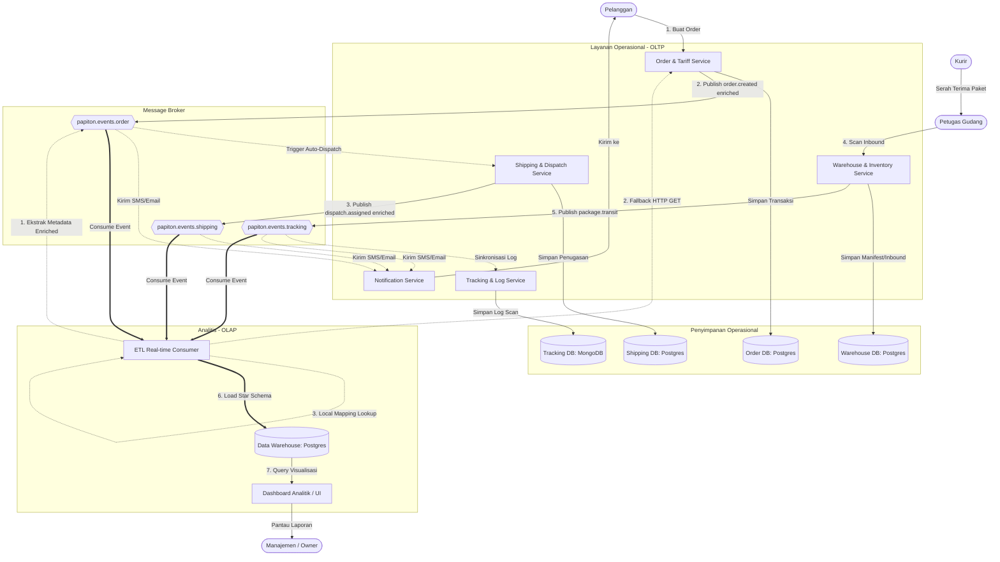

# 🔄 Aliran Data & Interaksi Antar-Service (PAPITON Express)

Dokumen ini menjelaskan aliran data (*data flow*) secara menyeluruh, baik interaksi operasional antar-microservice (OLTP) dengan dukungan keamanan (API Key), penelusuran (Correlation ID), pembatasan laju (Rate Limiting), maupun aliran data analitis ke Data Warehouse (OLAP) yang sepenuhnya ter-decouple dari database operasional.

---

## 🗺️ 1. Diagram Integrasi Sistem (End-to-End System Flow)

Diagram di bawah ini menggambarkan bagaimana sebuah transaksi berjalan, mulai dari pemesanan oleh pelanggan, penugasan kurir, pelacakan gudang, pengiriman notifikasi, hingga penyerapan data secara real-time ke Data Warehouse (DWH) tanpa adanya ketergantungan langsung dari ETL Service ke database operasional.

---

## 🔄 2. Detail Aliran Data Per-Siklus Transaksi

Berikut adalah penjelasan langkah demi langkah aliran data antar-service:

### A. Siklus Pembuatan Order (Order Creation Cycle)
1. **Pelanggan** membuat pesanan melalui UI dengan memanggil endpoint `POST /api/v1/orders`.
2. **Order Service** memvalidasi masukan (dimensi & berat wajib diisi), menghitung tarif pengiriman (menggunakan Redis Cache untuk jarak rute), dan menyimpan data order ke `order_db` dengan status `CREATED`.
3. **Order Service** mempublikasikan event `order.created` ke topik Kafka `papiton.events.order` dengan **payload yang diperkaya (enriched)**. Payload ini memuat seluruh detail paket (berat, panjang, lebar, tinggi, tarif total, kota asal, kota tujuan) dalam map metadata string.
4. **Notification Service** mendengarkan event ini dan mengirimkan email/push notifikasi konfirmasi pesanan ke Pelanggan secara riil menggunakan Firebase FCM dan SMTP Server.
5. **ETL Service** mendengarkan event ini:
   - Membaca metadata order langsung dari Kafka event payload.
   - Jika metadata kosong (fallback untuk kompatibilitas ke belakang), ETL Service melakukan pemanggilan HTTP GET REST API ke `Order & Tariff Service` (`/api/v1/orders/get?awb=...`) dengan menyertakan header `X-API-Key` dan `X-Correlation-ID`. ETL tidak pernah melakukan koneksi SQL langsung ke `order_db`.
   - Mengisi dimensi `dim_location` (lokasi asal/tujuan), `dim_service`, dan `dim_date` di Data Warehouse.
   - Membuat baris baru di tabel fakta `fact_shipment` (dengan `courier_id` set ke `'N/A'`, serta `driver_earnings` dan `driver_rating` set ke `0.0`).

### B. Siklus Penugasan Kurir (Courier Dispatch Cycle)
1. Event `order.created` di Kafka memicu **Shipping Service** untuk mencarikan kurir terdekat yang berstatus `AVAILABLE` di wilayah penjemputan.
2. **Shipping Service** menugaskan kurir tersebut, mengubah status kurir menjadi `ON_DUTY` di `shipping_db`, dan menyimpan data penugasan (*dispatch*).
3. **Shipping Service** mempublikasikan event `dispatch.assigned` ke topik Kafka `papiton.events.shipping` dengan payload yang diperkaya dengan jenis kendaraan (`vehicle_type`).
4. **ETL Service** mendengarkan event ini:
   - Membaca `courier_id` dan `vehicle_type` langsung dari Kafka event payload.
   - Menghitung performa driver (`driver_rating`) berdasarkan aturan jenis kendaraan lokal dan pendapatan driver (`driver_earnings` = 70% tarif) dari data tabel fakta di DWH.
   - Memperbarui kolom `courier_id` serta `driver_earnings` dan `driver_rating` di tabel fakta `fact_shipment`. Tidak ada query SQL langsung ke `shipping_db`.

### C. Siklus Transit & Inbound Gudang (Warehouse & Transit Cycle)
1. Kurir menjemput paket dari pengirim dan membawanya ke Hub asal (Gudang Transit).
2. Petugas gudang melakukan scan barcode paket melalui API `POST /api/v1/inbound` di **Warehouse Service**.
3. **Warehouse Service** memperbarui status paket menjadi `AT_HUB` di `warehouse_db`.
4. **Warehouse Service** mempublikasikan event `package.inbound` / `package.transit` ke topik Kafka `papiton.events.tracking`.
5. **Tracking Service** mengonsumsi event ini dan menyimpannya sebagai log sejarah perjalanan paket di database NoSQL MongoDB (`tracking_db`).
6. **ETL Service** mendengarkan event ini:
   - Melakukan resolusi informasi profil gudang (nama, kota, tipe, region) menggunakan kamus lokal `WAREHOUSES_MAP` di ETL Service atau membuat stub gudang otomatis di DWH. Tidak ada query SQL langsung ke `warehouse_db`.
   - Memperbarui status pengiriman dan `warehouse_key` di tabel fakta `fact_shipment`.

---

## 📊 3. Matriks Komponen Integrasi

| Nama Topik Kafka | Tipe Event | Pengirim (Producer) | Penerima Operasional (Consumer) | Aksi ETL (Data Warehouse Load) |
| :--- | :--- | :--- | :--- | :--- |
| `papiton.events.order` | `order.created` | Order & Tariff Service | Notification Service | Membaca payload, mengisi `dim_location`, `dim_service`, dan `fact_shipment` (tanpa query order-db). |
| `papiton.events.shipping` | `package.picked_up` / `dispatch.assigned` | Shipping & Dispatch Service | Notification Service | Membaca payload untuk memperbarui `courier_id` dan driver measures (`driver_earnings` & `driver_rating`) di `fact_shipment`. |
| `papiton.events.tracking` | `package.in_transit` / `package.delivered` | Warehouse / Shipping Service | Tracking & Log Service, Notification Service | Mengisi informasi gudang di `dim_warehouse` via mapping lokal dan meng-update status transit di `fact_shipment`. |
