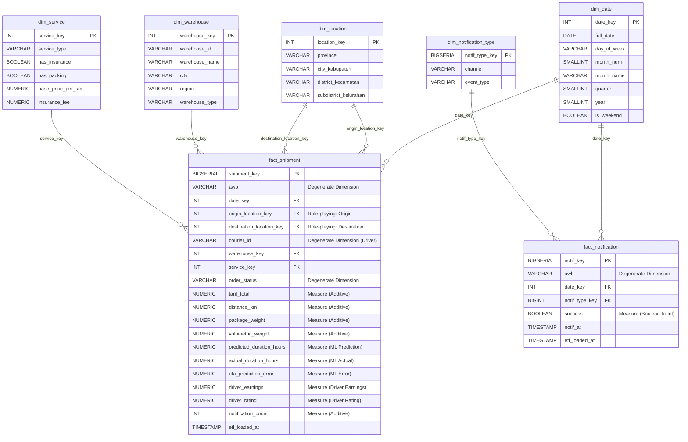

# PAPITON Express - Rancangan Data Warehouse [REVISI]

**Sistem Mikroservis Logistik Terintegrasi**
**Tugas Besar Komputasi Awan - Kelompok 5 (2026)**

---

## 👥 Anggota Tim

* **Muhammad Rizkiana Pratama** - Warehouse & Inventory Service
* **Nadhif Arva Anargya** - Tracking & Log Event Service
* **Shidqi Rasyad Firjatullah** - Order & Tariff Service
* **Dicka Fachrunaldo K.** - Shipping & Dispatch Service
* **Muhammad Fittra Novria** - Notification & Messaging Service

---

## 🔄 Ringkasan Perubahan Utama (Revisi)

Dokumen ini merupakan revisi dari rancangan DWH awal berdasarkan masukan dosen/reviewer. Perubahan difokuskan pada perbaikan konseptual star schema agar sesuai dengan prinsip data warehouse (agregatif, bukan menyimpan data transaksional individu sebagai dimensi):

### Perbaikan Utama (Revisi Kedua)
*   **Pembersihan Dimensi Individual & Profil Driver**: Menghapus `dim_order`, `dim_courier`, dan `dim_courier_profile`. Entitas individual atau profil kurir tidak lagi disimpan sebagai dimensi khusus.
*   **Penerapan Degenerate Dimension**: Kolom `awb` (kode resi transaksi), `order_status`, dan `courier_id` diletakkan langsung di dalam tabel fakta `fact_shipment` sebagai *degenerate dimension*. `courier_id` digunakan untuk agregasi jumlah driver unik (`COUNT(DISTINCT courier_id)`).
*   **Dimensi Lokasi Terstruktur (`dim_location`)**: Mengganti kolom teks alamat bebas/kota string dengan dimensi wilayah hierarkis terstruktur (`province`, `city_kabupaten`, `district_kecamatan`, `subdistrict_kelurahan`). Tabel fakta menggunakan role-playing dimension (`origin_location_key` dan `destination_location_key`).
*   **Driver Measures Terintegrasi**: Menyimpan metrik pendapatan (`driver_earnings`) dan performa (`driver_rating`) driver yang dihitung di database operasional langsung di dalam `fact_shipment` sebagai measure.
*   **Eksplisitasi Rumus Agregasi Measure**: Menjelaskan secara rinci tipe agregasi (`SUM`, `COUNT`, `AVG`, `COUNT(DISTINCT)`) untuk setiap metrik/measure yang disajikan pada laporan analitik.

---

# 1. 🌟 Rancangan Data Warehouse (Star Schema)

Proses identifikasi dilakukan dengan menganalisis metrik bisnis utama (Fakta) dan konteks analisis (Dimensi).

## Diagram Star Schema (Mermaid)

## Definisi Tabel Utama

### fact_shipment
Tabel fakta transaksi pengiriman. Butiran data (*grain*) adalah satu baris per resi pengiriman (AWB). Memiliki degenerate dimensions (`awb`, `order_status`, `courier_id`) dan referensi ke dimensi geografis pengirim/penerima.
*   **Measures**:
    *   `tarif_total` (Bisa di-`SUM` untuk total omzet atau di-`AVG` untuk rata-rata tarif)
    *   `distance_km` (Bisa di-`SUM` untuk total jarak tempuh or di-`AVG` untuk rata-rata jarak)
    *   `package_weight` (Bisa di-`AVG` untuk rata-rata berat paket)
    *   `volumetric_weight` (Bisa di-`AVG` untuk rata-rata berat volumetrik)
    *   `predicted_duration_hours` (Bisa di-`AVG` untuk durasi estimasi pengiriman hasil prediksi model ML)
    *   `actual_duration_hours` (Bisa di-`AVG` untuk durasi pengiriman aktual dalam jam)
    *   `eta_prediction_error` (Bisa di-`AVG` untuk mengukur rata-rata kesalahan prediksi model ML / MAE)
    *   `driver_earnings` (Pendapatan driver hasil kalkulasi operasional. Bisa di-`SUM` untuk total pendapatan driver, atau di-`AVG` untuk rata-rata pendapatan driver per pengiriman)
    *   `driver_rating` (Rating performa driver dari database operasional. Bisa di-`AVG` untuk memantau performa kualitas driver per wilayah/waktu)
    *   `notification_count` (Bisa di-`SUM` untuk total notifikasi yang dikirimkan)
    *   `COUNT(shipment_key)` (Agregasi dinamis untuk menghitung jumlah total paket/transaksi)
    *   `COUNT(DISTINCT courier_id)` (Untuk menghitung jumlah driver aktif)

### fact_notification
Tabel fakta untuk merekam pengiriman notifikasi dari sistem.
*   **Measures**:
    *   `success` (Bisa di-`SUM(CASE WHEN success THEN 1 ELSE 0 END)` untuk total notifikasi sukses, atau di-`AVG(CASE WHEN success THEN 1 ELSE 0 END)*100` untuk rasio persentase kesuksesan notifikasi).
    *   `COUNT(notif_key)` (Agregasi dinamis untuk menghitung jumlah total notifikasi yang dikirimkan)

### dim_location
Dimensi geografi terstruktur. Tidak ada alamat bebas (string acak), melainkan terbagi atas struktur administratif resmi: Provinsi (`province`), Kabupaten/Kota (`city_kabupaten`), Kecamatan (`district_kecamatan`), dan Kelurahan (`subdistrict_kelurahan`). Digunakan secara *role-playing* sebagai lokasi asal dan tujuan.

### Degenerate Driver Dimension (`courier_id`)
Driver di-modelkan menggunakan degenerate dimension `courier_id` langsung di tabel fakta. Hal ini memungkinkan DWH mengagregasi data berdasarkan driver (misalnya menghitung jumlah driver unik menggunakan `COUNT(DISTINCT courier_id)`) tanpa perlu membuat tabel dimensi khusus yang menyimpan data individual transaksional driver (seperti nama, nomor telepon, dll). Data pendapatan driver (`driver_earnings`) dan rating performa driver (`driver_rating`) dihitung di database operasional dan dimuat langsung sebagai measure/fakta.

### dim_date
Dimensi waktu dengan format Primary Key `YYYYMMDD` untuk mempermudah kueri analisis berbasis rentang tanggal.

### dim_warehouse
Dimensi lokasi gudang hub/transit. Menyimpan properti administratif gudang (`warehouse_id`, `warehouse_name`, `city`, `region`, `warehouse_type`).

### dim_notification_type
Dimensi tipe dan saluran notifikasi, mengelompokkan berdasarkan `channel` (email, push) dan `event_type` (order.created, package.picked_up, dll).

---

# 2. ⚙️ Proses ETL (Extraction, Transformation, Load)

Data diekstraksi secara real-time melalui Kafka Event Consumer dan disimpan ke dalam PostgreSQL Data Warehouse.

## Matriks Sumber Data
*   **Order DB**: Tabel `orders` untuk memuat data pengiriman dasar, tarif, berat, dan dimensi geografis awal.
*   **Shipping DB**: Tabel `couriers` dan `dispatches` untuk memuat data penugasan kurir dan memetakan profil kurir.
*   **Warehouse DB**: Tabel `warehouses` dan `inbound_packages` untuk memetakan transit gudang.
*   **Kafka Events**: Sebagai trigger real-time untuk pemrosesan ETL.

## Aturan Transformasi (T1-T10)
*   **T1 - Konsolidasi Data**: Menggabungkan data order dengan data penugasan kurir dan inbound gudang berdasarkan AWB.
*   **T2 - Normalisasi Wilayah**: Memetakan teks kota (e.g. "Bandung") ke dalam baris dimensi terstruktur `dim_location` (Provinsi, Kabupaten, Kecamatan, Kelurahan) menggunakan standarisasi kamus wilayah.
*   **T3 - Perhitungan Berat Volumetrik**: `(length_cm * width_cm * height_cm) / 6000.0`
*   **T4 - Penanganan NULL**: Mengisi driver ID kosong dengan nilai default `'N/A'` dan metrik pendapatan serta performa driver dengan `0.0` saat pesanan pertama kali dibuat.
*   **T5 - Prediksi Durasi Pengiriman (ML)**: Memprediksi `predicted_duration_hours` secara real-time saat order dibuat menggunakan model Regresi Linier (`scikit-learn`).
*   **T6 - Perhitungan Error Estimasi (ML)**: Menghitung `actual_duration_hours` and `eta_prediction_error` saat paket terkirim (`DELIVERED`) serta men-trigger latih ulang model secara otomatis.
*   **T7 - Pengambilan Metrik Operasional Driver**: Saat event penugasan kurir terjadi, sistem ETL mengambil ID kurir dari database operasional, dan menghitung `driver_earnings` (misal 70% dari tarif total) serta menyalin `driver_rating` operasional untuk dimuat ke tabel fakta.

---

# 3. 📊 Laporan dan Analitik (OLAP Metrics)

Berikut adalah definisi matrik laporan operasional yang dibangun di atas rancangan Star Schema ini:

| ID Laporan | Nama Laporan | Dimensi Analisis | Formula Agregasi (Measures) | Tujuan Bisnis |
| :--- | :--- | :--- | :--- | :--- |
| **L1** | **Volume & Revenue Pengiriman** | `dim_date.year`, `dim_date.month_name`, `dim_service.service_type` | <ul><li>`COUNT(fact_shipment.shipment_key)` (Jumlah Paket)</li><li>`SUM(fact_shipment.tarif_total)` (Total Pendapatan)</li><li>`AVG(fact_shipment.tarif_total)` (Rata-rata Tarif)</li></ul> | Mengukur performa pertumbuhan transaksi dan pendapatan bulanan per jenis layanan. |
| **L2** | **Performa & Pendapatan Driver** | `dim_date.year`, `dim_date.month_name`, `dim_location.province` (Wilayah Asal) | <ul><li>`AVG(fact_shipment.driver_earnings)` (Rata-rata Pendapatan Driver)</li><li>`AVG(fact_shipment.driver_rating)` (Rata-rata Rating Performa Driver)</li><li>`COUNT(DISTINCT fact_shipment.courier_id)` (Jumlah Driver Aktif)</li></ul> | Menganalisis rata-rata pendapatan harian dan rating performa driver berdasarkan wilayah dan periode waktu. |
| **L3** | **Analisis Kemacetan Hub (Warehouse)** | `dim_warehouse.warehouse_name`, `fact_shipment.order_status` | <ul><li>`COUNT(fact_shipment.shipment_key)` (Jumlah Paket Tertahan/Transit)</li></ul> | Mengidentifikasi bottleneck penumpukan barang pada gudang hub tertentu. |
| **L4** | **Penyebaran Geografis Pengiriman** | `dim_location.province` (Asal), `dim_location.city_kabupaten` (Tujuan) | <ul><li>`COUNT(fact_shipment.shipment_key)` (Jumlah Transaksi)</li><li>`SUM(fact_shipment.tarif_total)` (Total Omzet)</li></ul> | Mengetahui rute dan wilayah pengiriman dengan kepadatan volume tertinggi untuk alokasi resource. |
| **L5** | **Rasio Keberhasilan Notifikasi** | `dim_notification_type.channel`, `dim_notification_type.event_type` | <ul><li>`COUNT(fact_notification.notif_key)` (Total Notifikasi Terkirim)</li><li>`AVG(fact_notification.success::INT) * 100` (Persentase Keberhasilan)</li></ul> | Mengukur kualitas pengiriman notifikasi SMS/Email ke customer. |
| **L6** | **Akurasi Model Prediksi ETA (ML)** | `dim_date.year`, `dim_date.month_name`, `dim_service.service_type` | <ul><li>`AVG(ABS(fact_shipment.eta_prediction_error))` (Mean Absolute Error / MAE)</li><li>`AVG(fact_shipment.actual_duration_hours)` (Rata-rata Durasi Pengiriman)</li></ul> | Memantau akurasi performa kecerdasan buatan (ML) dalam mengestimasi durasi pengiriman secara bulanan. |
