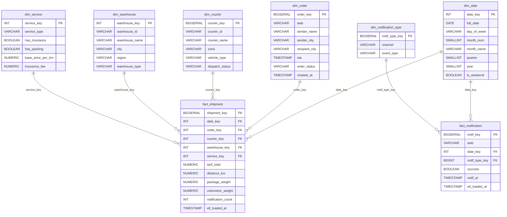

# PAPITON Express - Rancangan Data Warehouse [REVISI]

**Sistem Mikroservis Logistik Terintegrasi**
**Tugas Besar Komputasi Awan - Kelompok 5 (2026)**

---

## 👥 Anggota Tim

* **Muhammad Rizkiana Pratama** - Warehouse & Inventory Service
* **Nadhif Arva Anargya** - Tracking & Log Event Service
* **Shidqi Rasyad Firjatullah** - Order & Tariff Service
* **Dicka Fachrunaldo K.** - Shipping & Dispatch Service
* **Muhammad Fittra Novria** - Notification & Messaging Service

---

## 🔄 Ringkasan Perubahan Utama (Revisi)

Dokumen ini merupakan revisi dari `TUBES_3.pdf` berdasarkan hasil review. Perubahan difokuskan pada tiga kategori: (1) Error konseptual star schema, (2) Aturan ETL yang tidak valid/spesifik, dan (3) Inkonsistensi mapping sumber data.

### Perbaikan Utama

* Penghapusan kolom redundan (`is_express`) dari `fact_shipment`.
* Pembuatan dimensi baru `dim_notification_type` untuk mengatasi kolom non-measure di tabel fakta.
* Pengubahan Primary Key `dim_date` menjadi format `INT YYYYMMDD`.
* Penambahan *sentinel row* pada `dim_courier` untuk menangani *NULL values*.
* Penambahan aturan transformasi ETL untuk kalkulasi `volumetric_weight` dan `notification_count`.

---

# 1. 🌟 Rancangan Data Warehouse (Star Schema)

Proses identifikasi dilakukan dengan menganalisis metrik bisnis utama (Fakta) dan konteks analisis (Dimensi).

## Diagram Star Schema (Mermaid)



## Definisi Tabel Utama

### fact_shipment

Tabel fakta utama dengan grain satu baris per transaksi pengiriman (AWB).

### fact_notification

Tabel sub-fakta yang berisi status keberhasilan notifikasi.

### dim_date

Dimensi waktu dengan PK format `YYYYMMDD` untuk mendukung efisiensi *range query*.

### dim_courier

Dilengkapi *sentinel row* (`courier_key = -1`) untuk status pengiriman "Belum Ditugaskan".

### dim_notification_type

Menampung atribut `channel` (email, push notification, dll.) dan `event_type` (ORDER_CREATED, IN_TRANSIT, DELIVERED, dll.).

---

# 2. ⚙️ Proses ETL (Extraction, Transformation, Load)

Data diekstraksi dari lima database operasional dengan arsitektur *database-per-service* dan diproses secara batch setiap hari pukul 01.00 WIB.

## Matriks Sumber Data

| Service               | Sumber Data                                                                             |
| --------------------- | --------------------------------------------------------------------------------------- |
| Order & Tariff        | Tabel `orders` dari `papiton_order_tariff_service_db`                                   |
| Shipping & Dispatch   | Tabel `couriers` dan `dispatches` dari `shipping_test_db`                               |
| Warehouse & Inventory | Tabel `inbound_packages`, `manifests`, dan `manifest_packages` dari `papiton_warehouse` |
| Tracking & Log        | Koleksi `tracking_logs` dari `tracking_db` (MongoDB)                                    |
| Notification          | Tabel `notification_logs`                                                               |

## Aturan Transformasi (T1-T10)

### T1 - Konsolidasi Data

Menggabungkan seluruh data staging berdasarkan AWB menggunakan `LEFT JOIN`.

### T2 - Perhitungan Berat Volumetrik

Menghitung `volumetric_weight` menggunakan rumus:

```sql
(length_cm * width_cm * height_cm) / 6000.0
```

### T5 - Agregasi Notifikasi

Menghitung jumlah notifikasi sukses (`notification_count`) untuk setiap AWB.

### T8 - Penanganan Nilai NULL

Apabila kurir belum ditugaskan, data akan diarahkan ke *sentinel row* pada `dim_courier`.

## Fase Load

1. Memuat seluruh tabel dimensi menggunakan mekanisme UPSERT.
2. Memuat tabel `fact_shipment` menggunakan idempotency check.
3. Menjalankan Data Integrity Check untuk validasi hasil ETL.

---

# 3. 📊 Laporan dan Analitik

Data Warehouse dirancang untuk mendukung dashboard analitik berbasis OLAP.

## L1 - Volume & Revenue Pengiriman per Periode

Mengukur volume transaksi dan omzet pengiriman berdasarkan periode waktu.

## L2 - Performa Kurir per Zona

Mengukur produktivitas kurir berdasarkan wilayah operasional.

## L3 - Performa Gudang (Hub)

Mengidentifikasi bottleneck logistik pada setiap fasilitas distribusi.

## L4 - Distribusi Jenis Layanan

Menganalisis pola penggunaan layanan oleh pelanggan.

## L5 - Rute Pengiriman Populer

Mengidentifikasi jalur pengiriman dengan volume tertinggi antar kota.

## L6 - Efektivitas Notifikasi

Mengukur tingkat keberhasilan notifikasi berdasarkan kanal komunikasi menggunakan `fact_notification`.
