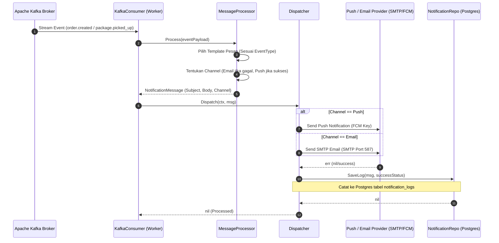

# Dokumentasi Alur Notification & Messaging Service
**Layanan Notifikasi Email & Push Notification**

Service ini bertindak sebagai worker yang mendengarkan event Kafka secara real-time. Ketika terjadi perubahan status pengiriman, service ini otomatis mengirimkan email (SMTP) atau push notification (FCM) ke pelanggan, serta mencatat log audit pengiriman ke PostgreSQL database.

---

## 1. Spesifikasi Teknis & Database
*   **Port Layanan**: `8080` (Container) ➔ `8084` (Host)
*   **Penyimpanan**: PostgreSQL database (`notification_db` pada container `notification-db:5436`)
*   **Tabel Database**: `notification_logs`
*   **Kafka Listener**: Mendengarkan topik `papiton.events.order`, `papiton.events.shipping`, dan `papiton.events.tracking`.

---

## 2. Fitur Keandalan & Keamanan
*   **Gateway Routing**: Seluruh request dari luar diarahkan melalui ETL Proxy / API Gateway (`http://localhost:8085/api/proxy/notifications/...`) yang otomatis menyuntikkan header keamanan `X-API-Key` and `X-Correlation-ID`.
*   **Otentikasi API Key**: Middleware `requireAPIKey` memvalidasi header `X-API-Key`. Jika tidak cocok atau kosong, mengembalikan status **401 Unauthorized**.
*   **Pembatasan Laju (Rate Limiting)**: Middleware `withRateLimit` membatasi request maksimal 100 RPM per IP client, jika terlampaui mengembalikan **429 Too Many Requests**.
*   **Correlation ID**: Middleware `withCorrelationID` melacak request tunggal dengan `X-Correlation-ID` (mengekstrak atau men-generate jika kosong).
*   **Server Timeouts**: Server dikonfigurasi dengan `ReadTimeout: 15s`, `WriteTimeout: 15s`, dan `IdleTimeout: 60s`.
*   **Startup Fail-Fast**: Sistem melakukan pemeriksaan koneksi database Postgres (`db.Ping()`) pada startup awal. Jika database offline, aplikasi akan langsung berhenti (`log.Fatalf`).

---

## 3. API Endpoints
*   `GET /api/v1/notifications/logs` : Mengambil daftar seluruh log pengiriman notifikasi yang pernah terjadi.
*   `POST /api/v1/notifications/send-direct` : Mengirim notifikasi push/email secara manual langsung ke pelanggan (override administrator).

---

## 4. Diagram Alur Kerja (Sequence Diagram)

