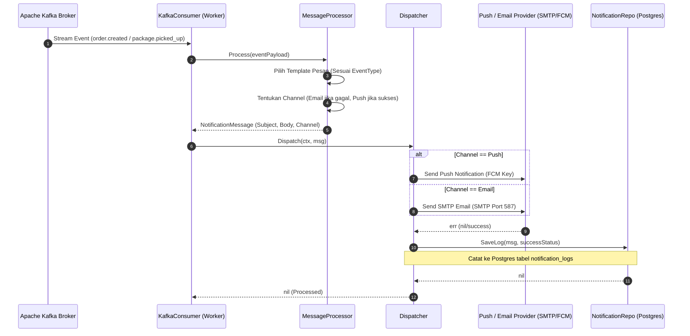

# Dokumentasi Alur Notification & Messaging Service
**Layanan Notifikasi Email & Push Notification**

Service ini bertindak sebagai worker yang mendengarkan event Kafka secara real-time. Ketika terjadi perubahan status pengiriman, service ini otomatis mengirimkan email (SMTP) atau push notification (FCM) ke pelanggan, serta mencatat log audit pengiriman ke PostgreSQL.

---

## 1. Spesifikasi Teknis & Database
*   **Port Layanan**: `8080` (Container) ➔ `8084` (Host)
*   **Penyimpanan**: PostgreSQL database (`shipping_test_db` / shared dengan database shipping)
*   **Tabel Database**: `notification_logs`
*   **Kafka Listener**: Mendengarkan topik `papiton.events.order`, `papiton.events.shipping`, dan `papiton.events.tracking`.

---

## 2. API Endpoints
*   `GET /api/v1/notifications/logs` : Mengambil daftar seluruh log pengiriman notifikasi yang pernah terjadi.
*   `POST /api/v1/notifications/send-direct` : Mengirim notifikasi push/email secara manual langsung ke pelanggan (override administrator).

---

## 3. Diagram Alur Kerja (Sequence Diagram)

