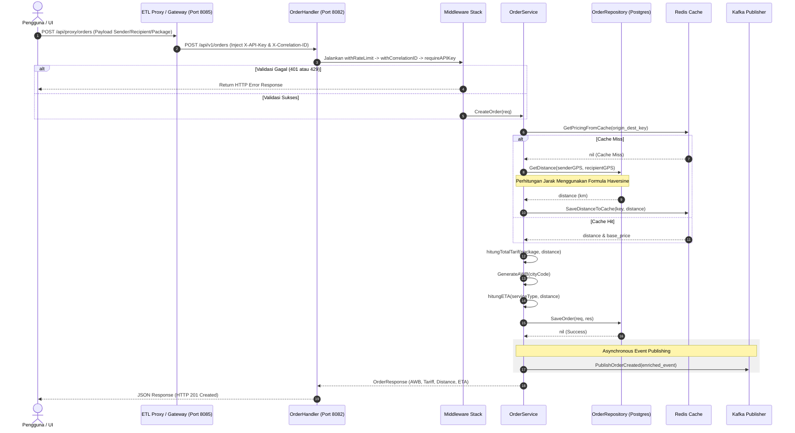

# Dokumentasi Alur Order & Tariff Service
**Layanan Pembuatan Order & Kalkulasi Tarif**

Service ini bertanggung jawab untuk melayani pembuatan order pengiriman barang baru, melakukan estimasi waktu pengiriman (ETA), dan menghitung ongkos kirim (tarif) berdasarkan jarak koordinat GPS (Haversine).

---

## 1. Spesifikasi Teknis & Database
*   **Port Layanan**: `8080` (Container) ➔ `8082` (Host)
*   **Penyimpanan**: PostgreSQL database (`papiton_order_tariff_service_db`)
*   **Tabel Database**: `orders`
*   **Event Broker**: Apache Kafka (Topik: `papiton.events.order` — payload diperkaya/enriched dengan properti dimensi, berat, kota asal/tujuan, dan tarif total)
*   **Caching**: Redis (`order-redis:6379`) dengan TTL 24 jam untuk kalkulasi rute berulang

---

## 2. Fitur Keandalan & Keamanan
*   **Gateway Routing**: Seluruh request dari luar diarahkan melalui ETL Proxy / API Gateway (`http://localhost:8085/api/proxy/orders`) yang otomatis menyuntikkan header keamanan `X-API-Key` dan `X-Correlation-ID`.
*   **Otentikasi API Key**: Middleware `requireAPIKey` memvalidasi header `X-API-Key`. Jika tidak cocok atau kosong, mengembalikan status **401 Unauthorized**.
*   **Pembatasan Laju (Rate Limiting)**: Middleware `withRateLimit` membatasi request maksimal 100 RPM per IP client, jika terlampaui mengembalikan **429 Too Many Requests**.
*   **Correlation ID**: Middleware `withCorrelationID` melacak request tunggal dengan `X-Correlation-ID` (mengekstrak atau men-generate jika kosong).
*   **Server Timeouts**: Server dikonfigurasi dengan `ReadTimeout: 15s`, `WriteTimeout: 15s`, dan `IdleTimeout: 60s`.
*   **Startup Fail-Fast**: Sistem melakukan pemeriksaan koneksi database (`db.Ping()`) pada saat startup awal. Jika database mati, aplikasi akan langsung berhenti (`log.Fatalf`) dan mencegah dummy state.

---

## 3. API Endpoints
*   `POST /api/v1/orders` : Membuat order pengiriman baru.
*   `GET /api/v1/orders/get` : Mengambil seluruh daftar order.
*   `GET /api/v1/orders/get?awb=XXX` : Mengambil detail order spesifik berdasarkan nomor resi (AWB).
*   `POST /api/v1/tariff/calculate` : Kalkulator ongkir mandiri tanpa menyimpan data (untuk simulasi).

---

## 4. Diagram Alur Kerja (Sequence Diagram)

