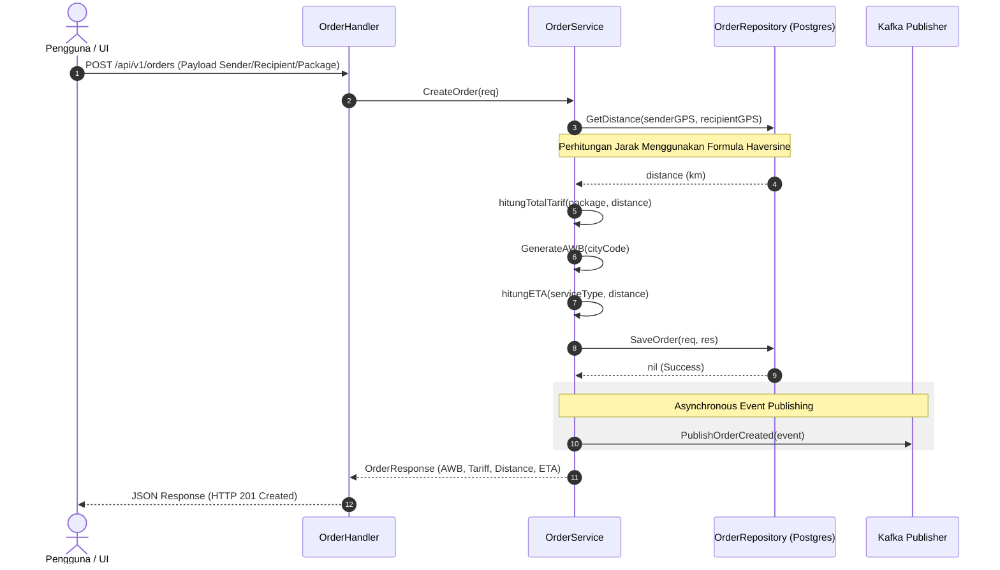

# Dokumentasi Alur Order & Tariff Service
**Layanan Pembuatan Order & Kalkulasi Tarif**

Service ini bertanggung jawab untuk melayani pembuatan order pengiriman barang baru, melakukan estimasi waktu pengiriman (ETA), dan menghitung ongkos kirim (tarif) berdasarkan jarak koordinat GPS (Haversine).

---

## 1. Spesifikasi Teknis & Database
*   **Port Layanan**: `8082` (Container) ➔ `8082` (Host)
*   **Penyimpanan**: PostgreSQL database (`papiton_order_tariff_service_db`)
*   **Tabel Database**: `orders`
*   **Event Broker**: Apache Kafka (Topik: `papiton.events.order`)

---

## 2. API Endpoints
*   `POST /api/v1/orders` : Membuat order pengiriman baru.
*   `GET /api/v1/orders/get` : Mengambil seluruh daftar order.
*   `GET /api/v1/orders/get?awb=XXX` : Mengambil detail order spesifik berdasarkan nomor resi (AWB).
*   `POST /api/v1/tariff/calculate` : Kalkulator ongkir mandiri tanpa menyimpan data (untuk simulasi).

---

## 3. Diagram Alur Kerja (Sequence Diagram)

