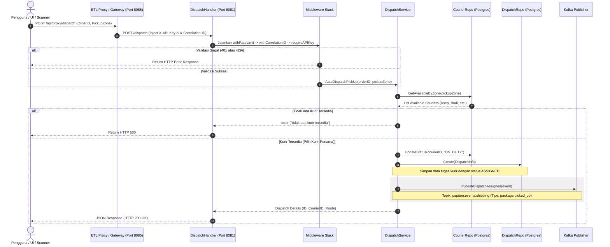

# Dokumentasi Alur Shipping & Courier Service
**Layanan Manajemen Kurir & Auto-Dispatch**

Service ini mengelola pendaftaran kurir, status ketersediaan kurir, penugasan kurir secara otomatis berdasarkan kecocokan zona penjemputan (*Auto-Dispatch*), serta koordinat GPS real-time kurir.

---

## 1. Spesifikasi Teknis & Database
*   **Port Layanan**: `8080` (Container) ➔ `8081` (Host)
*   **Penyimpanan**:
    *   PostgreSQL database (`shipping_test_db`) untuk tabel `couriers` dan `dispatches`.
    *   MongoDB database (`shipping_db`) untuk data spasial koordinat GPS real-time kurir (`locations` collection).
*   **Event Broker**: Apache Kafka (Topik: `papiton.events.shipping` — Tipe Event: `package.picked_up`, payload diperkaya dengan `courier_id`, `vehicle_type`, `status` = `"dispatch.assigned"`, dan `route_instruction`)

---

## 2. Fitur Keandalan & Keamanan
*   **Gateway Routing**: Seluruh request dari luar diarahkan melalui ETL Proxy / API Gateway (`http://localhost:8085/api/proxy/dispatch`, `.../couriers/register`, dll.) yang otomatis menyuntikkan header keamanan `X-API-Key` dan `X-Correlation-ID`.
*   **Otentikasi API Key**: Middleware `requireAPIKey` memvalidasi header `X-API-Key`. Jika tidak cocok atau kosong, mengembalikan status **401 Unauthorized**.
*   **Pembatasan Laju (Rate Limiting)**: Middleware `withRateLimit` membatasi request maksimal 100 RPM per IP client, jika terlampaui mengembalikan **429 Too Many Requests**.
*   **Correlation ID**: Middleware `withCorrelationID` melacak request tunggal dengan `X-Correlation-ID` (mengekstrak atau men-generate jika kosong).
*   **Server Timeouts**: Server dikonfigurasi dengan `ReadTimeout: 15s`, `WriteTimeout: 15s`, dan `IdleTimeout: 60s`.
*   **Startup Fail-Fast**: Sistem melakukan pemeriksaan koneksi database Postgres (`db.Ping()`) dan MongoDB (`client.Ping()`) pada startup awal. Jika database offline, aplikasi akan langsung berhenti (`log.Fatalf`).

---

## 3. API Endpoints
*   `POST /dispatch` : Memilih kurir terdekat secara otomatis dan membuat log tugas (*dispatch*).
*   `POST /api/v1/couriers/register` : Mendaftarkan armada kurir baru.
*   `GET /api/v1/couriers` : Detail kurir (`?id=XXX`) atau daftar kurir per zona (`?zone=XXX`).
*   `PUT /api/v1/couriers/status` : Mengubah status ketersediaan kurir (*AVAILABLE, ON_DUTY, OFFLINE*).
*   `PUT /api/v1/couriers/location` : Mengirim koordinat GPS real-time kurir.
*   `POST /api/v1/dispatches/confirm` : Mengonfirmasi bahwa paket telah dijemput (*Confirm Pick-Up*).

---

## 4. Diagram Alur Kerja (Sequence Diagram)

