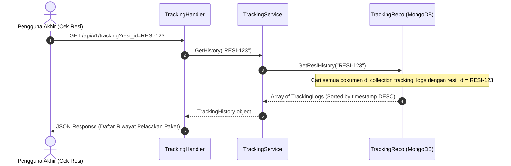

# Dokumentasi Alur Tracking & Log Event Service
**Layanan Audit Log & Pelacakan Resi**

Service ini mengelola pencatatan histori perjalanan paket secara terperinci. Layanan ini didesain untuk menampung log pemindaian logistik berfrekuensi tinggi (*high-frequency log writing*).

---

## 1. Spesifikasi Teknis & Database
*   **Port Layanan**: `8080` (Container) ➔ `8083` (Host)
*   **Penyimpanan**: MongoDB database (`tracking_db`)
*   **Collections**: `tracking_logs` dan `tracking_histories`
*   **Kafka Listener**: Mendengarkan topik `papiton.events.tracking` untuk menyimpan data status pelacakan secara dinamis.

---

## 2. API Endpoints
*   `GET /api/v1/tracking?resi_id=XXX` : Mengambil seluruh history pergerakan paket berdasarkan nomor resi.
*   `POST /api/v1/tracking/scan` : Pencatatan manual log scan paket di titik checkpoint oleh admin.
*   `GET /api/v1/tracking/logs` : Mengambil daftar audit log pelacakan mentah (administrator).

---

## 3. Diagram Alur Kerja (Sequence Diagram)

