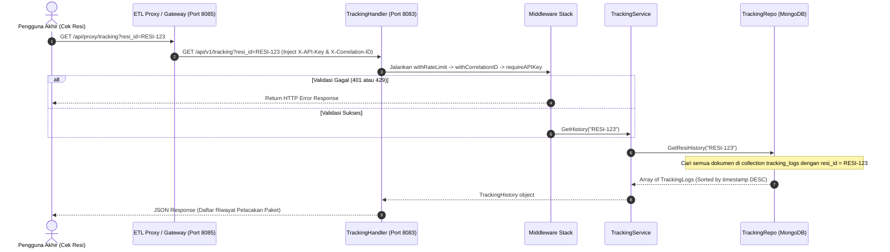

# Dokumentasi Alur Tracking & Log Event Service
**Layanan Audit Log & Pelacakan Resi**

Service ini mengelola pencatatan histori perjalanan paket secara terperinci. Layanan ini didesain untuk menampung log pemindaian logistik berfrekuensi tinggi (*high-frequency log writing*) dan kueri pelacakan resi.

---

## 1. Spesifikasi Teknis & Database
*   **Port Layanan**: `8080` (Container) ➔ `8083` (Host)
*   **Penyimpanan**: MongoDB database (`tracking_db` - collection `tracking_logs`)
*   **Event Broker**: Apache Kafka (Topic Listener: `papiton.events.order`, `papiton.events.shipping`, `papiton.events.tracking`) untuk sinkronisasi histori secara otomatis dan asinkron.

---

## 2. Fitur Keandalan & Keamanan
*   **Gateway Routing**: Seluruh request dari luar diarahkan melalui ETL Proxy / API Gateway (`http://localhost:8085/api/proxy/tracking`) yang otomatis menyuntikkan header keamanan `X-API-Key` dan `X-Correlation-ID`.
*   **Otentikasi API Key**: Middleware `requireAPIKey` memvalidasi header `X-API-Key`. Jika tidak cocok atau kosong, mengembalikan status **401 Unauthorized**.
*   **Pembatasan Laju (Rate Limiting)**: Middleware `withRateLimit` membatasi request maksimal 100 RPM per IP client, jika terlampaui mengembalikan **429 Too Many Requests**.
*   **Correlation ID**: Middleware `withCorrelationID` melacak request tunggal dengan `X-Correlation-ID` (mengekstrak atau men-generate jika kosong).
*   **Server Timeouts**: Server dikonfigurasi dengan `ReadTimeout: 15s`, `WriteTimeout: 15s`, dan `IdleTimeout: 60s`.
*   **Startup Fail-Fast**: Sistem melakukan pemeriksaan koneksi database MongoDB (`client.Ping()`) pada startup awal. Jika database offline, aplikasi akan langsung berhenti (`log.Fatalf`).

---

## 3. API Endpoints
*   `GET /api/v1/tracking?resi_id=XXX` : Mengambil seluruh history pergerakan paket berdasarkan nomor resi.
*   `POST /api/v1/tracking/scan` : Pencatatan manual log scan paket di titik checkpoint oleh admin.
*   `GET /api/v1/tracking/logs` : Mengambil daftar audit log pelacakan mentah (administrator).

---

## 4. Diagram Alur Kerja (Sequence Diagram)

