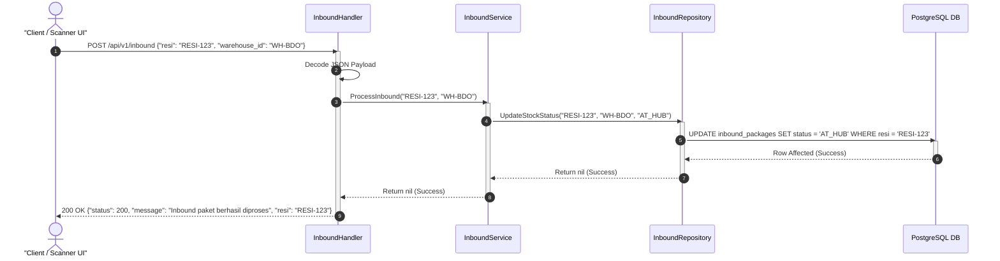
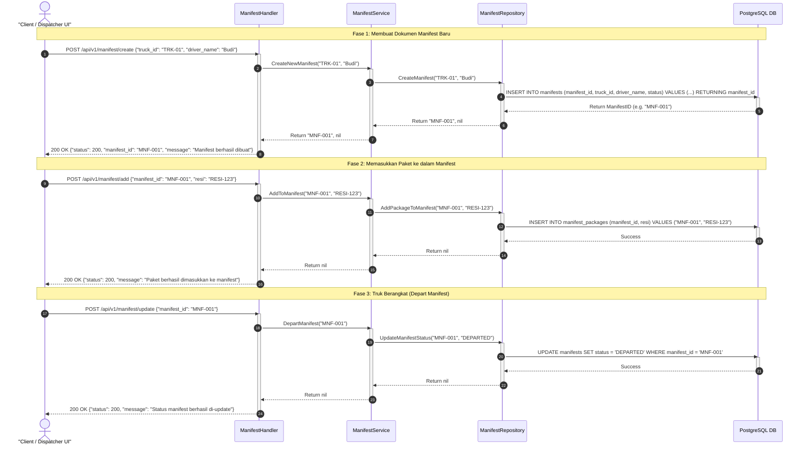

# Warehouse & Inventory Service
Layanan ini bertanggung jawab mengelola operasional pergudangan (*Hub*), pemrosesan paket masuk (*inbound*), penyortiran paket (*sorting*), serta pengelompokan paket ke dalam kontainer truk keberangkatan (*manifest*).

Layanan ini dirancang menggunakan **Clean Architecture** (pemisahan layer *handler*, *service*, *repository*, dan *model*) serta ditulis dalam bahasa pemrograman **Go**.

---

## ⚡ Arsitektur & Struktur Direktori

```
warehouse-and-inventory-service/
├── cmd/
│   └── main.go                  # Entrypoint utama aplikasi (HTTP server & routing)
├── internal/
│   ├── handler/                 # HTTP controllers (inbound & manifest handlers)
│   ├── model/                   # Data transfer objects (DTO) & request/response structs
│   ├── repository/              # Data access layer (PostgreSQL implementation)
│   └── service/                 # Core business logic
├── migrations/                  # File migrasi database PostgreSQL
├── mocks/                       # Mocking repository untuk keperluan unit testing
└── test/
    └── helpers/                 # Test helpers & db container setup
```

---

## 📥 1. Inbound Flow (Penerimaan Paket)

Dipicu saat paket pertama kali discan di gudang/hub asal untuk mengubah status logistik menjadi `AT_HUB`.



---

## 🚚 2. Outbound / Manifest Flow (Pemberangkatan Truk)

Alur penyusunan manifest untuk memasukkan paket ke dalam truk logistik dan merilis keberangkatannya.



---

## 🛠️ Uji Coba Unit Testing

Layanan ini dilengkapi dengan pengujian murni unit test menggunakan *interface mocking* (`gomock`) dan SQL Mock (`go-sqlmock`).

Untuk menjalankan pengujian unit secara mandiri:
```bash
go test -v ./...
```
