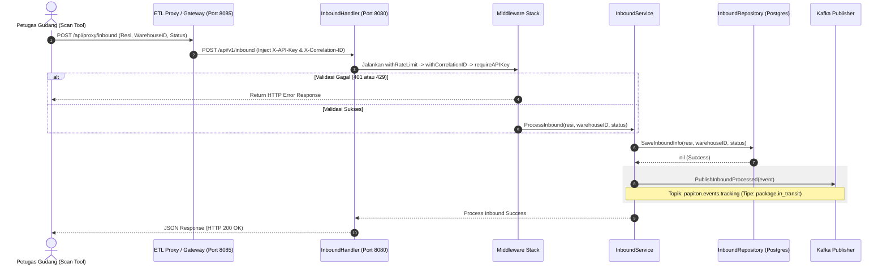

# Dokumentasi Alur Warehouse & Inventory Service
**Layanan Manajemen Gudang & Manifest**

Service ini mengelola pencatatan kedatangan paket di gudang transit (*inbound*), pembuatan manifest truk pengiriman logistik antar-gudang, serta alokasi barang masuk ke armada truk.

---

## 1. Spesifikasi Teknis & Database
*   **Port Layanan**: `8080` (Container) ➔ `8080` (Host)
*   **Penyimpanan**: PostgreSQL database (`papiton_warehouse`)
*   **Tabel Database**: `warehouses`, `inbound_packages`, `manifests`, `manifest_packages`, `sorting_lanes`
*   **Event Broker**: Apache Kafka (Topik: `papiton.events.tracking` — Tipe Event: `package.in_transit`, payload memuat properti `location` = `"Warehouse WH-XXX"` dan `status` = `"inventory.inbound"`)

---

## 2. Fitur Keandalan & Keamanan
*   **Gateway Routing**: Seluruh request dari luar diarahkan melalui ETL Proxy / API Gateway (`http://localhost:8085/api/proxy/inbound`) yang otomatis menyuntikkan header keamanan `X-API-Key` dan `X-Correlation-ID`.
*   **Otentikasi API Key**: Middleware `requireAPIKey` memvalidasi header `X-API-Key`. Jika tidak cocok atau kosong, mengembalikan status **401 Unauthorized**.
*   **Pembatasan Laju (Rate Limiting)**: Middleware `withRateLimit` membatasi request maksimal 100 RPM per IP client, jika terlampaui mengembalikan **429 Too Many Requests**.
*   **Correlation ID**: Middleware `withCorrelationID` melacak request tunggal dengan `X-Correlation-ID` (mengekstrak atau men-generate jika kosong).
*   **Server Timeouts**: Server dikonfigurasi dengan `ReadTimeout: 15s`, `WriteTimeout: 15s`, dan `IdleTimeout: 60s`.
*   **Startup Fail-Fast**: Sistem melakukan pemeriksaan koneksi database (`db.Ping()`) pada saat startup awal. Jika database offline, aplikasi akan langsung berhenti (`log.Fatalf`).

---

## 3. API Endpoints
*   `POST /api/v1/inbound` : Memproses kedatangan paket di gudang asal/tujuan transit.
*   `POST /api/v1/manifest/create` : Membuat rute manifest logistik baru.
*   `POST /api/v1/manifest/add` : Memasukkan paket-paket ke manifest truk logistik.
*   `POST /api/v1/manifest/update` : Mengubah status manifest (*DEPARTED / ARRIVED*).

---

## 4. Diagram Alur Kerja (Sequence Diagram)

