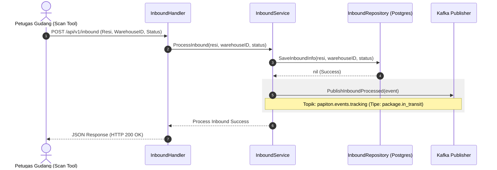

# Dokumentasi Alur Warehouse & Inventory Service
**Layanan Manajemen Gudang & Manifest**

Service ini mengelola pencatatan kedatangan paket di gudang transit (*inbound*), pembuatan manifest truk pengiriman logistik antar-gudang, serta alokasi barang masuk ke armada truk.

---

## 1. Spesifikasi Teknis & Database
*   **Port Layanan**: `8080` (Container) ➔ `8080` (Host)
*   **Penyimpanan**: PostgreSQL database (`papiton_warehouse`)
*   **Tabel Database**: `warehouses`, `inbound_packages`, `manifests`, `manifest_packages`
*   **Event Broker**: Apache Kafka (Topik: `papiton.events.tracking` — Tipe Event: `package.in_transit`)

---

## 2. API Endpoints
*   `POST /api/v1/inbound` : Memproses kedatangan paket di gudang asal/tujuan transit.
*   `POST /api/v1/manifest/create` : Membuat rute manifest logistik baru.
*   `POST /api/v1/manifest/add` : Memasukkan paket-paket ke manifest truk logistik.
*   `POST /api/v1/manifest/update` : Mengubah status manifest (*DEPARTED / ARRIVED*).

---

## 3. Diagram Alur Kerja (Sequence Diagram)

